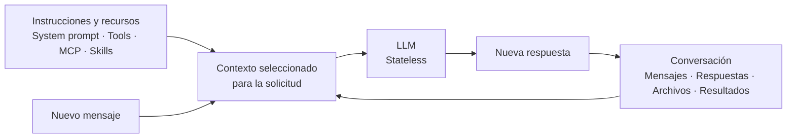

# Contexto en conversaciones con LLM

## 1. Qué significa que un LLM sea *stateless*

Un modelo de lenguaje (LLM) no conserva por sí solo las interacciones anteriores. Para responder de forma coherente, la aplicación le envía la información pertinente junto con cada solicitud. A ese conjunto se le llama **contexto**.

```text
Contexto = instrucciones + conversación + información adicional
```

La aplicación decide qué información incluir; no necesariamente vuelve a enviar todo el historial en cada solicitud.

## 2. Qué puede formar parte del contexto

El contexto puede combinar instrucciones y recursos con el contenido generado durante la sesión.

### Instrucciones y recursos

Según la plataforma y la configuración, puede incluir:

- System prompt.
- Herramientas (tools) y servidores MCP.
- Skills y agentes personalizados.
- Archivos de instrucciones, como `AGENTS.md` o `CLAUDE.md`.

### Contenido de la sesión

Durante una conversación pueden aportar contexto:

- Mensajes del usuario y respuestas del modelo.
- Archivos e imágenes compartidos.
- Resultados de herramientas, comandos y pruebas.
- Información recuperada durante la sesión.

El historial de la sesión suele ser el contenido que más crece y que puede resumirse o compactarse cuando deja de ser necesario en detalle.

## 3. Cómo crece una conversación

Una conversación puede acumular mensajes y resultados anteriores:

```text
Solicitud 1: Prompt 1

Solicitud 2: Prompt 1 + Respuesta 1 + Prompt 2

Solicitud 3: Prompt 1 + Respuesta 1 + Prompt 2 + Respuesta 2 + Prompt 3
```

Cuanto más historial se incluya en una solicitud, más tokens puede consumir. La cantidad concreta depende del contexto que la aplicación decida enviar.

## 4. Flujo del contexto



La respuesta nueva pasa a formar parte de la conversación. La aplicación puede incluirla en solicitudes posteriores junto con otra información relevante.

## 5. Tamaño del contexto y “Smart Zone”

Una ventana de contexto grande no implica que siempre convenga llenarla. Si se envía demasiada información irrelevante, pueden aumentar el consumo de tokens y el costo, y puede resultar más difícil mantener el foco o priorizar instrucciones vigentes.

El rango de **40 % a 60 %** se presenta aquí como una referencia práctica informal, no como un límite técnico universal ni una garantía de calidad:

```text
0%                         100%
┌────────────────┬────────────────┐
│   SMART ZONE   │   DUMB ZONE     │
└────────────────┴────────────────┘
        referencia aproximada: 40%–60%
```

## 6. Compactar el contexto

En conversaciones largas, se puede resumir el historial antiguo y conservar la información que todavía guía el trabajo:

```text
Resumen
Decisiones importantes
Estado actual
Pendientes
Nuevo mensaje
```

El objetivo es reducir el historial que se necesita enviar sin perder decisiones, estado o tareas pendientes que sigan siendo útiles.

> **El modelo no recuerda por sí solo la conversación: la aplicación le proporciona contexto. Cuando ese contexto crece, conviene conservar lo relevante y resumir lo demás.**
