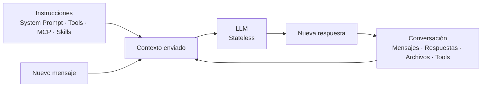

# Contexto en conversaciones con LLM

## El LLM es stateless

Un LLM es **stateless**: no recuerda por sí mismo las interacciones anteriores.

Para mantener una conversación coherente, la aplicación debe volver a enviar el **contexto** en cada nueva solicitud.

```text
Contexto = instrucciones + conversación + información adicional
```

## ¿Qué forma parte del contexto?

Hay dos grupos principales.

### Contexto poco configurable por el usuario

Puede incluir:

- System Prompt.
- Tools.
- MCPs.
- Skills.
- Custom Agents.
- Archivos de instrucciones como `AGENTS.md` o `CLAUDE.md`.

Este contenido suele ser agregado automáticamente por la plataforma o el agente.

### Contexto que el usuario puede compactar

Es el contenido que crece durante la conversación:

- Mensajes del usuario.
- Respuestas del modelo.
- Archivos e imágenes.
- Resultados de herramientas.
- Comandos y tests.
- Información recuperada durante la sesión.

Esta es la parte que más conviene optimizar.

## ¿Cómo crece el contexto?

Cada nueva interacción puede incluir el historial anterior.

```text
Solicitud 1
Prompt 1

Solicitud 2
Prompt 1
Respuesta 1
Prompt 2

Solicitud 3
Prompt 1
Respuesta 1
Prompt 2
Respuesta 2
Prompt 3
```

Cuanto más larga es la conversación, más contexto puede enviarse al modelo y mayor puede ser el consumo de tokens.

## Flujo del contexto



La nueva respuesta pasa a formar parte de la conversación y puede incluirse nuevamente en solicitudes posteriores.

## Smart Zone y Dumb Zone

Aunque un modelo soporte una ventana de contexto grande, no siempre conviene llenarla completamente.

Como referencia práctica:

```text
0%                         100%
┌────────────────┬────────────────┐
│   SMART ZONE   │   DUMB ZONE    │
└────────────────┴────────────────┘
        aprox. 40% - 60%
```

La zona entre **40% y 60%** puede utilizarse como una referencia práctica y no como un límite técnico universal.

Cuando el contexto crece demasiado pueden aparecer:

- Mayor consumo de tokens.
- Más información irrelevante.
- Mayor costo.
- Menor precisión.
- Conflictos con instrucciones antiguas.

## Compactar el contexto

En conversaciones largas conviene reemplazar parte del historial antiguo por información resumida.

```text
Resumen
+
Decisiones importantes
+
Estado actual
+
Pendientes
+
Nuevo mensaje
```

La idea no es eliminar contexto indiscriminadamente, sino conservar la información que sigue siendo útil.

> **El LLM no recuerda la conversación: recibe contexto. Cuanto más contexto acumulamos, más tokens se utilizan y más importante se vuelve compactarlo.**
