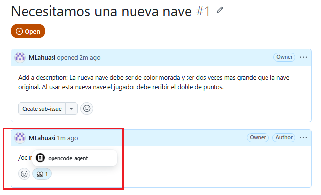
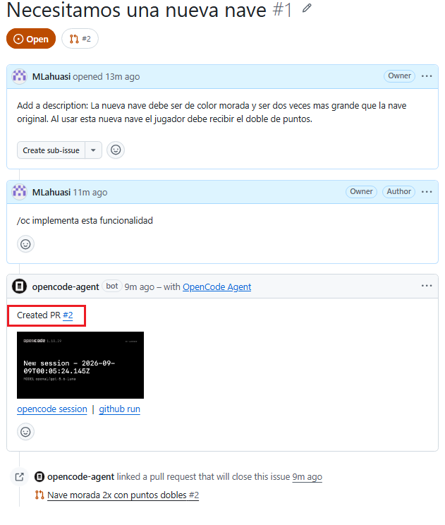
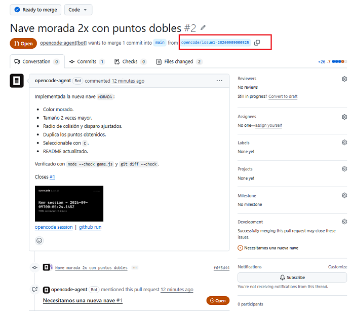
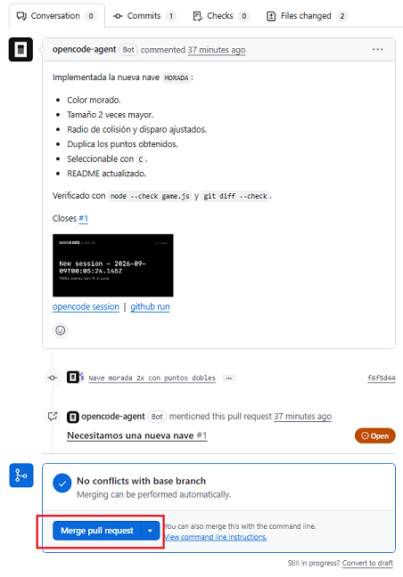
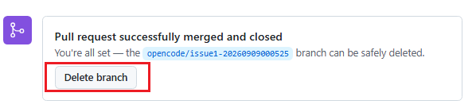
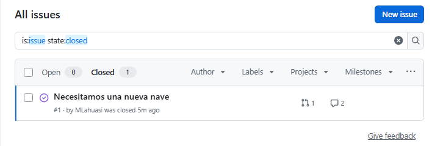

# [Integrar `OpenCode` con Git y GitHub](https://github.com/MLahuasi/opencode-asteroids)

OpenCode puede integrarse con Git y GitHub para planificar, implementar, revisar y versionar cambios dentro de un proyecto.

En términos generales:

```text
Git
│
├── Control de versiones local
├── Branches
├── Commits
├── Merges
└── Worktrees

GitHub
│
├── Repositorio remoto
├── Issues
├── Pull Requests
└── GitHub Actions

OpenCode
│
├── Planifica cambios
├── Implementa cambios
├── Puede trabajar sobre ramas y Worktrees
└── Puede ejecutarse desde GitHub Actions
```

Este documento utiliza un juego de Asteroids para mostrar diferentes formas de integrar estas herramientas.

---

## Parte I — Desarrollo local con Git y Worktrees

### 1. Implementar una funcionalidad utilizando una rama

El primer ejemplo consiste en implementar un nuevo power-up llamado `velocidad`.

El flujo será:

```text
main
  │
  └── feature branch
          │
          ├── `OpenCode` / Plan
          ├── `OpenCode` / Build
          └── Commit
                  │
                  ▼
                Merge
                  │
                  ▼
                 main
```

#### 1.1. Crear la rama

Crear una nueva rama y cambiarse a ella:

```bash
git switch -c 01-powerup-velocity
```

Alternativamente:

```bash
git checkout -b 01-powerup-velocity
```

La funcionalidad queda aislada de `main` mientras se desarrolla.

---

#### 1.2. Planificar la funcionalidad con OpenCode

Abrir `OpenCode` sobre el repositorio y utilizar el modo `Plan`.

Solicitar:

```text
Agrega una nueva característica (feature) o power-up al juego que se llamará `velocidad`, cuyo objetivo es permitirle al personaje moverse al doble de velocidad durante cinco segundos.
```

`OpenCode` puede hacer preguntas adicionales para definir correctamente el comportamiento antes de modificar el código. Por ejemplo:

> - ¿Cómo debería obtenerse el power-up `velocidad`?
> - ¿Qué debe duplicarse durante los 5 segundos?
> - Si se recoge otro mientras está activo, ¿cómo se actualiza la duración?
> - ¿Con qué frecuencia debería aparecer?
> - ¿Cuánto dura un power-up sin recoger?

El modo `Plan` permite definir primero las reglas de la funcionalidad y reducir decisiones ambiguas durante la implementación.

---

#### 1.3. Implementar el plan

Cambiar `OpenCode` al modo `Build` y solicitar:

```text
Implementa el plan
```

`OpenCode` implementará los cambios definidos durante la planificación.

---

#### 1.4. Revisar y crear el commit

Antes del commit es recomendable revisar:

```bash
git status
```

Después:

```bash
git add .
git commit -m "Add power-up velocidad"
```

Los cambios quedan registrados en la rama:

```text
01-powerup-velocity
```

---

#### 1.5. Integrar la funcionalidad en `main`

Cambiar a:

```bash
git switch main
```

Integrar la rama:

```bash
git merge 01-powerup-velocity
```

El flujo utilizado fue:

```text
main
  │
  ├── 01-powerup-velocity
  │       │
  │       ├── Plan
  │       ├── Build
  │       └── Commit
  │
  └────── Merge ──────► main
```

> En proyectos colaborativos normalmente puede utilizarse un Pull Request antes de integrar cambios a `main`. El merge directo se utiliza aquí para simplificar el ejemplo.

---

### 2. Trabajar en paralelo con Git Worktrees

#### 2.1. ¿Qué es un Worktree?

Un `worktree` permite tener varias copias de trabajo del mismo repositorio, cada una asociada a una rama distinta, sin tener que clonar el repositorio varias veces.

Esto resulta especialmente útil con `OpenCode` porque cada Worktree puede ejecutarse en una terminal y sesión independiente.

```bash
Repositorio
    │
    ├── Worktree A (copia main) ──► `OpenCode` #1
    ├── Worktree B (copia main) ──► `OpenCode` #2
    └── Worktree C (copia main) ──► `OpenCode` #3
```

Las sesiones pueden trabajar simultáneamente sin cambiar constantemente de rama.

---

**Ejemplo**: Crear un `Worktree` para las siguientes funcionalidades:

```text
triple-shot
skins-system
shield
```

Ejecutar:

```bash
git worktree add .worktrees/triple-shot
git worktree add .worktrees/skins-system
git worktree add .worktrees/shield
```

Si las ramas todavía no existen, `Git` crea automáticamente una rama utilizando el último segmento de la ruta.

Por ejemplo:

```md
**Worktree**: `.worktrees/triple-shot`
**Branch**: `triple-shot`
```

La estructura será similar a:

```text
asteroids/
│
├── .git/
├── .worktrees/
│   ├── triple-shot/
│   ├── skins-system/
│   └── shield/
└── ...
```

Cada directorio contiene su propia copia de trabajo del proyecto.

**NOTA**: Es recomendable Ignorar `.worktrees` en `.gitignore`.

---

### 3. Ejecutar varias sesiones de OpenCode

Abrir una `consola` apuntando a cada `Worktree`.

Por ejemplo:

```text
Terminal 1
.worktrees/triple-shot

Terminal 2
.worktrees/skins-system

Terminal 3
.worktrees/shield
```

En cada una ejecutar:

```bash
opencode
```

Las sesiones en `OpenCode` pueden funcionar simultáneamente porque trabajan sobre `Worktrees` y `ramas independientes`.

```text
                    Repositorio Git
                          │
          ┌───────────────┼───────────────┐
          │               │               │
          ▼               ▼               ▼
     triple-shot      skins-system     shield
          │               │               │
          ▼               ▼               ▼
     `OpenCode` #1   `OpenCode` #2   `OpenCode` #3
          │               │               │
      Plan/Build      Plan/Build      Plan/Build
```

---

### 4. Planificar las funcionalidades

Cada sesión puede planificar su funcionalidad independientemente.

#### 4.1. Branch `triple-shot`

En modo `Plan`:

```text
Planea la implementación de triple shot: por 5 segundos, el personaje dispara 3 veces en línea recta.
```

#### 4.2. Branch `skins-system`

En modo `Plan`:

```text
Planea la implementación de un sistema de skins: poder cambiar la apariencia de la nave.
```

#### 4.3. Branch `shield`

En modo `Plan`:

```text
Planea la implementación de un escudo: un escudo que protege a la nave de los proyectiles enemigos.
```

---

### 5. Implementar los planes

En cada sesión cambiar a modo `Build` y ejecutar:

```text
Implementa el plan
```

Cada sesión de `OpenCode` modificará únicamente la copia de trabajo correspondiente a su Worktree.

---

### 6. Crear los commits

Una vez implementada y revisada cada funcionalidad, registrar los cambios.

#### 6.1. Manualmente

Desde cada Worktree:

```bash
git add .
git commit -m "Add ..."
```

Por ejemplo:

```bash
git add .
git commit -m "Add triple shot"
```

El mismo proceso se realiza en cada Worktree.

---

#### 6.2. Utilizando OpenCode

También se puede solicitar a cada sesión de OpenCode:

```text
Ejecuta el commit de los cambios
```

OpenCode puede revisar los cambios y ejecutar el commit sobre la rama correspondiente.

---

### 7. Unificar las funcionalidades

Después de completar `triple-shot`, `skins-system` y `shield`, se puede utilizar una rama temporal de integración.

Esto permite probar las tres funcionalidades juntas antes de modificar `main`.

> Crear varios Worktrees no integra sus cambios automáticamente. Cada Worktree apunta a una rama; para que `union-worktree` contenga las funcionalidades, hay que integrar en ella las ramas completadas con Git. OpenCode puede ayudar a revisar o resolver conflictos después de esa integración.

```bash
triple-shot ────┐
                │
skins-system ───┼──► union-worktree ───► main
                │
shield ─────────┘
```

#### 7.1. Crear la rama de integración

Desde `main`:

```bash
git switch -c union-worktree
```

Alternativamente:

```bash
git checkout -b union-worktree
```

---

#### 7.2. Abrir `OpenCode` en la rama de integración

Verificar la rama activa:

```bash
git branch
```

OpenCode debe ejecutarse sobre:

```text
union-worktree
```

---

#### 7.3. Integrar las ramas y planificar la revisión

Primero, desde `union-worktree`, integra las ramas que ya contienen los commits de cada funcionalidad:

```bash
git merge triple-shot
git merge skins-system
git merge shield
```

Si aparecen conflictos, resuélvelos y completa el merge —agrega los archivos resueltos y crea el commit correspondiente— antes de iniciar el siguiente. Luego abre OpenCode en esta rama y, en modo `Plan`, solicita revisar la integración conjunta:

```text
Revisa la integración de las funcionalidades triple-shot, skins-system y shield en esta rama.
Comprueba que funcionen conjuntamente, identifica conflictos de comportamiento y propón los ajustes necesarios.
No elimines Worktrees ni ramas.
```

Los `git merge` registran la integración en la rama. Si OpenCode propone ajustes adicionales, revísalos y registra esos cambios después de validarlos.

---

#### 7.4. Implementar la integración

Las ramas ya quedaron fusionadas mediante Git en el paso anterior. Si el plan propone ajustes de código, impleméntalos en `union-worktree` con `Build`:

```text
Implementa el plan
```

Después revisa y prueba el resultado. Los merges ya registran las ramas; crea un commit adicional solo si quedaron ajustes sin registrar.

---

### 8. Revisar y registrar la integración

#### 8.1. Verificar la rama

```bash
git switch union-worktree
```

Una salida posible:

```text
M       README.md
M       game.js
Switched to branch 'union-worktree'
```

La letra `M` indica que existen modificaciones locales.

---

#### 8.2. Revisar el estado

```bash
git status
```

Esto permite verificar qué archivos fueron modificados.

---

#### 8.3. Agregar los cambios al staging

```bash
git add .
```

Verificar nuevamente:

```bash
git status
```

Ejemplo:

```text
Changes to be committed:

    modified: README.md
    modified: game.js
```

Los archivos están preparados para el próximo commit.

---

#### 8.4. Advertencia LF / CRLF

En Windows puede aparecer:

```text
LF will be replaced by CRLF
```

Esto corresponde a los finales de línea utilizados por diferentes sistemas operativos:

```text
LF      Linux / macOS
CRLF    Windows
```

No significa que `git add` haya fallado.

---

#### 8.5. Crear un commit para ajustes adicionales

Este paso solo aplica si OpenCode realizó ajustes adicionales después de completar los merges. Los conflictos de un merge deben resolverse y registrarse al completar ese merge.

```bash
git commit -m "Resolve integration adjustments"
```

Ejemplo:

```text
[union-worktree 0022e39] Add union worktrees
3 files changed, 261 insertions(+), 53 deletions(-)
create mode 100644 .gitignore
```

---

#### 8.6. Cómo se registran los cambios

El commit guarda los archivos preparados en el staging area dentro del historial del repositorio:

```text
Working Directory
      │
      │ git add .
      ▼
Staging Area
      │
      │ git commit
      ▼
Repository / Commit
```

---

### 9. Integrar la rama temporal en `main`

Cambiar a:

```bash
git switch main
```

Realizar el merge:

```bash
git merge union-worktree
```

---

### 10. Consultar ramas y Worktrees

Antes de limpiar el repositorio es útil verificar qué ramas y Worktrees continúan existiendo.

#### 10.1. Ver ramas

```bash
git branch
```

Ejemplo:

```text
* main
+ shield
+ skins-system
+ triple-shot
  union-worktree
```

Donde:

```text
*  rama activa
+  rama utilizada actualmente por otro Worktree
```

---

#### 10.2. Ver Worktrees

```bash
git worktree list
```

Ejemplo:

```text
.../asteroids                           0022e39 [main]
.../asteroids/.worktrees/shield         098d4f2 [shield]
.../asteroids/.worktrees/skins-system   b3a9552 [skins-system]
.../asteroids/.worktrees/triple-shot    97d471a [triple-shot]
```

Esta información permite conocer:

- Directorio del Worktree.
- Commit actual.
- Rama asociada.

---

### 11. Eliminar Worktrees

Una vez integradas las funcionalidades:

```bash
git worktree remove .worktrees/shield
git worktree remove .worktrees/skins-system
git worktree remove .worktrees/triple-shot
```

Comprobar:

```bash
git worktree list
```

Es preferible utilizar `git worktree remove` en lugar de borrar manualmente los directorios.

---

### 12. Eliminar ramas temporales

Después de eliminar los Worktrees:

```bash
git branch -d shield
git branch -d skins-system
git branch -d triple-shot
git branch -d union-worktree
```

Diferencia:

```text
-d  Elimina la rama si Git considera que ya fue integrada.

-D  Fuerza la eliminación aunque existan commits exclusivos.
```

Siempre que sea posible conviene utilizar:

```bash
git branch -d <branch>
```

`-d` elimina ramas que Git considera integradas. Usa `-D` solo si quieres descartar deliberadamente commits que no se hayan integrado.

---

### 13. Flujo completo `OpenCode` + Git Worktrees

```text
                         Git / main
                             │
              Crear funcionalidades independientes
                             │
          ┌──────────────────┼──────────────────┐
          │                  │                  │
          ▼                  ▼                  ▼
     triple-shot        skins-system          shield
          │                  │                  │
     Worktree #1         Worktree #2        Worktree #3
          │                  │                  │
     `OpenCode` #1         `OpenCode` #2        `OpenCode` #3
          │                  │                  │
        Plan               Plan               Plan
          │                  │                  │
        Build              Build              Build
          │                  │                  │
        Commit             Commit             Commit
          │                  │                  │
          └──────────────────┬──────────────────┘
                             │
                             ▼
                       union-worktree
                             │
                Merge de las ramas de features
                             │
                       `OpenCode` Plan
                             │
                       `OpenCode` Build
                             │
                      Prueba conjunta
                             │
             Commit si hay ajustes adicionales
                             │
                            Merge
                             │
                             ▼
                            main
                             │
                    Eliminar Worktrees
                             │
                    Eliminar ramas usadas
```

**NOTA**: Esta acción se puede simplificar creando [`Comando Personalizado - OpenCode`](./12-opencode-commads.md)

---

## Parte II — Integrar OpenCode con GitHub

### 14. Integrar `OpenCode` con GitHub

Documentación oficial:

[OpenCode - GitHub](https://opencode.ai/docs/github/)

La integración permite utilizar `OpenCode` desde:

```text
GitHub Issues
Pull Requests
GitHub Actions
```

Conceptualmente:

```text
GitHub
   │
   ▼
Issue / Pull Request
   │
   ▼
GitHub Action
   │
   ▼
OpenCode
   │
   ├── analiza
   ├── responde
   ├── implementa
   └── puede crear Pull Requests
```

---

### 15. Instalar `OpenCode` Agent en GitHub

#### 15.1. Ejecutar la instalación

Desde una terminal situada dentro del repositorio, actualiza `main` y crea una rama para revisar el workflow que generará el instalador:

```bash
git switch main
git pull --ff-only
git switch -c chore/opencode-github-agent
```

Ejecuta fuera de OpenCode:

```bash
opencode github install
```

Después de completar la instalación conviene reiniciar OpenCode.

Durante el proceso se solicita:

1. Autorizar `OpenCode` en GitHub.
2. Seleccionar el proveedor.
3. Seleccionar el modelo.
4. Configurar el workflow necesario.

Una salida posible:

```text
┌    Install GitHub agent
│
◇  GitHub app already installed
│
◇  Select provider
│  OpenAI
│
◇  Select model
│  GPT-5.6 Luna
│
◆  Added workflow file: ".github/workflows/opencode.yml"
│
└  Next steps:

    1. Commit the `.github/workflows/opencode.yml` file and push
    2. Add the following secrets in org or repo settings

       - OPENAI_API_KEY

    3. Go to a GitHub issue and comment `/oc summarize`
```

Los nombres del proveedor, modelo y pasos siguientes dependen de la configuración elegida y pueden variar.

El workflow generado en este proyecto puede consultarse directamente en:

[`.github/workflows/opencode.yml`](https://github.com/MLahuasi/opencode-asteroids/blob/main/.github/workflows/opencode.yml)

También se pueden consultar los workflows del proyecto desde:

[`.github/workflows/`](https://github.com/MLahuasi/opencode-asteroids/tree/main/.github/workflows)

---

#### 15.2. Administrar `OpenCode` Agent en GitHub

Durante la instalación se agrega `OpenCode Agent` a GitHub.

Para administrar la instalación ingresar en:

```text
settings/installations
```

Desde esta sección se puede:

- Revisar la instalación de `OpenCode` Agent.
- Consultar los repositorios autorizados.
- Modificar el acceso.
- Desinstalar la aplicación.

> Se mantienen estas rutas en la documentación porque permiten identificar rápidamente dónde realizar cada configuración dentro de GitHub.

---

#### 15.3. Configurar la API Key del proveedor

Si se utiliza OpenAI, se debe configurar:

```text
OPENAI_API_KEY
```

Dentro del repositorio de GitHub ingresar en:

```text
settings/secrets/actions
```

La navegación corresponde aproximadamente a:

```text
Repository
└── Settings
    └── Secrets and variables
        └── Actions
```

Desde esta sección se crea el secreto utilizado por el workflow.

> El nombre del secreto depende del proveedor seleccionado.

> `OPENAI_API_KEY` corresponde al acceso mediante API. Una suscripción de ChatGPT no sustituye la API Key necesaria para ejecutar el proveedor desde GitHub Actions.

---

#### 15.4. Publicar el workflow

Registra el workflow generado y súbelo desde `chore/opencode-github-agent`:

```bash
git status
git add .github/workflows/opencode.yml
git commit -m "Configure OpenCode GitHub agent"
git push -u origin chore/opencode-github-agent
```

Revisa el cambio mediante un Pull Request antes de integrarlo en `main`.

El archivo publicado puede revisarse directamente en:

[`.github/workflows/opencode.yml`](https://github.com/MLahuasi/opencode-asteroids/blob/main/.github/workflows/opencode.yml)

---

### 16. Realizar cambios desde GitHub Issues

#### 16.1. Habilitar Issues

Si `Issues` no se encuentra habilitado, ingresar dentro del repositorio en:

```text
/settings
```

Buscar:

```text
Features
```

y habilitar:

```text
Issues
```

La navegación corresponde a:

```text
Repository
└── Settings
    └── Features
        └── Issues
```

---

#### 16.2. Crear un Issue

Desde `Issues`, crear un nuevo Issue.

Ejemplo:

```text
Add a title:
Necesitamos una nueva nave

Add a description:
La nueva nave debe ser de color morada y ser dos veces más grande que la nave original.

Al usar esta nueva nave el jugador debe recibir el doble de puntos.
```

---

#### 16.3. Delegar la implementación a OpenCode

Agregar un comentario al Issue:

```text
/oc implementa esta funcionalidad
```

OpenCode empieza a implementar el cambio mediante GitHub Actions.



---

### 17. Pull Request generado por OpenCode

Cuando la tarea requiere modificar código, `OpenCode` puede:

```text
Crear una rama
Implementar los cambios
Crear commits
Crear un Pull Request
```

OpenCode crea el Pull Request:



Para abrirlo, seleccionar el identificador correspondiente.

Por ejemplo:

```text
#2
```



---

### 18. Validar localmente el Pull Request

Antes de realizar el merge se puede revisar la implementación localmente.

Actualizar referencias:

```bash
git fetch origin
```

Ver ramas remotas:

```bash
git branch -r
```

Cambiar a la rama creada por OpenCode:

```bash
git switch opencode/issue1-20260909000525
```

Si es necesario crear explícitamente el seguimiento remoto:

```bash
git switch --track origin/opencode/issue1-20260909000525
```

Actualizar:

```bash
git pull
```

Después se puede:

- Ejecutar la aplicación.
- Revisar los cambios.
- Ejecutar pruebas.
- Validar el comportamiento.

---

### 19. Aprobar el Pull Request

Si los cambios son correctos, realizar el merge desde GitHub.



Después puede eliminarse la rama utilizada por el Pull Request.



Actualizar las referencias locales:

```bash
git fetch --prune origin
git branch -r
```

`--prune` elimina referencias locales a ramas remotas que ya no existen.

Si también existe una copia local de la rama y ya no es necesaria:

```bash
git branch -d opencode/issue1-20260909000525
```

El Issue puede quedar cerrado después de completar la funcionalidad.



---

### 20. Flujo GitHub Issue → `OpenCode` → Pull Request

```text
GitHub Issue
     │
     │ /oc implementa...
     ▼
GitHub Action
     │
     ▼
OpenCode
     │
     ├── Analiza el Issue
     ├── Modifica el proyecto
     └── Crea una rama
              │
              ▼
         Pull Request
              │
              ▼
        Revisión local
              │
              ▼
            Merge
              │
              ▼
             main
```

Este flujo permite solicitar trabajo a `OpenCode` directamente desde GitHub sin ejecutar manualmente el agente desde el entorno local.

---

## Parte III — Automatizar tareas con GitHub Actions

### 21. GitHub Actions personalizados con OpenCode

OpenCode también puede utilizarse dentro de workflows personalizados.

Antes de implementar uno, crea una rama desde la versión actualizada de `main` y trabaja en ella. Así podrás revisar el workflow en un Pull Request antes de publicarlo.

Por ejemplo:

```bash
git switch main
git pull --ff-only
git switch -c automation/issue-labeler
```

Por ejemplo, se puede crear una automatización que se ejecute cuando se crea un nuevo Issue.

Los workflows del proyecto pueden consultarse en:

[`.github/workflows/`](https://github.com/MLahuasi/opencode-asteroids/tree/main/.github/workflows)

---

#### 21.1. Solicitar el workflow

En modo `Plan`:

```text
Crea un GitHub Action que se ejecute cuando se cree un nuevo Issue.

Debe leer el título y contenido del Issue, analizarlo con `OpenCode` y asignar automáticamente etiquetas según el contenido, por ejemplo: `bug`, `enhancement`, `question`, `documentation`.

También debe enriquecer y reorganizar el contenido del Issue para que sea más claro y útil para su revisión, manteniendo siempre la intención, el contexto y la idea original expresada por el usuario.

No uses `GITHUB_TOKEN` ni un token personal de GitHub. Usa la autenticación y el acceso proporcionados por `OpenCode` para interactuar con GitHub.

No debe crear commits, ramas ni Pull Requests. La publicación del workflow se realizará manualmente.
```

Después revisar el plan e implementarlo desde `Build`.

---

### 22. Configurar permisos de OpenCode

Para configurar permisos específicos del proyecto se puede utilizar el archivo:

[`opencode.json`](https://github.com/MLahuasi/opencode-asteroids/blob/main/opencode.json)

ubicado en la raíz del proyecto.

Ejemplo:

```json
{
  "$schema": "https://opencode.ai/config.json",
  "permission": {
    "external_directory": {
      "/tmp/**": "allow"
    },
    "bash": "allow"
  }
}
```

En este ejemplo:

```text
external_directory
```

permite trabajar sobre `/tmp/**`.

Y:

```text
bash
```

permite ejecutar comandos mediante shell.

> Estos permisos pertenecen a `OpenCode` y no deben confundirse con los permisos definidos dentro de GitHub Actions.

Solo deben habilitarse los permisos realmente necesarios para el proyecto.

---

### 23. Permisos del GitHub Action

El workflow tiene su propio sistema de permisos.

Para un workflow que modifica Issues pueden requerirse permisos como:

```yaml
permissions:
  id-token: write
  issues: write
```

Conceptualmente:

```text
id-token: write
    │
    └── permite el mecanismo de autenticación utilizado por OpenCode

issues: write
    │
    ├── modificar etiquetas
    ├── modificar contenido
    └── publicar información en el Issue
```

Los permisos de GitHub Actions se definen dentro del workflow correspondiente en:

[`.github/workflows/`](https://github.com/MLahuasi/opencode-asteroids/tree/main/.github/workflows)

---

### 24. Eventos automáticos de GitHub

OpenCode no necesita ejecutarse únicamente mediante comentarios `/oc`.

También puede utilizarse con eventos automáticos como:

```text
Issue creado
Issue modificado
Pull Request creado
Pull Request actualizado
Ejecución manual
Ejecución programada
```

Por ejemplo:

```yaml
on:
  issues:
    types: [opened]
```

Cuando el workflow se ejecuta automáticamente debe existir un `prompt` que indique a `OpenCode` qué hacer, porque en este caso no existe un comentario `/oc` que proporcione la instrucción.

Por ejemplo:

```text
Analiza el Issue recién creado.

Clasifícalo y agrega las etiquetas correspondientes.

Reorganiza su contenido para mejorar su claridad sin modificar la intención original.
```

---

### 25. Publicar el GitHub Action personalizado

Una vez implementado con `Build` y revisado el resultado, confirma que estás en la rama de trabajo y registra el workflow:

```bash
git status
git add .github/workflows/<workflow>.yml
git commit -m "GitHub Action - Issue Labeler"
git push -u origin automation/issue-labeler
```

Abre un Pull Request para integrar el cambio en `main`.

Los workflows publicados pueden consultarse directamente en:

[`.github/workflows/`](https://github.com/MLahuasi/opencode-asteroids/tree/main/.github/workflows)

---

### 26. Probar el etiquetado automático

En GitHub crear un nuevo Issue.

Ejemplo:

```text
Add a title:
Incrementar el tamaño de la pantalla

Add a description:
La pantalla del juego debe ser duplicada
```

OpenCode ejecuta el GitHub Action para analizar el Issue y asignar una etiqueta apropiada.

Por ejemplo:

```text
enhancement
```

---

### 27. Implementar posteriormente el Issue

La clasificación automática del Issue y su implementación pueden mantenerse como procesos independientes.

El primer workflow puede encargarse únicamente de:

```text
Analizar
Reorganizar
Etiquetar
```

Después, cuando se decida implementar la funcionalidad, agregar el comentario:

```text
/oc implementa lo solicitado
```

OpenCode podrá iniciar el proceso de implementación y crear el correspondiente Pull Request.

---

#### 27.1. Validar los cambios

Aplica el mismo procedimiento de las secciones 18 y 19: trae la rama, revisa y prueba los cambios, integra el Pull Request y limpia las referencias remotas. En este ejemplo, la rama generada es `opencode/issue6-20260909171116`.

---

## Referencias y visión general

### 28. Referencias del proyecto

#### Repositorio

[OpenCode Asteroids](https://github.com/MLahuasi/opencode-asteroids)

#### Archivos

- [`.github/workflows/opencode.yml`](https://github.com/MLahuasi/opencode-asteroids/blob/main/.github/workflows/opencode.yml)
- [`.github/workflows/`](https://github.com/MLahuasi/opencode-asteroids/tree/main/.github/workflows)
- [`.opencode/command/worktree.md`](https://github.com/MLahuasi/opencode-asteroids/blob/main/.opencode/command/worktree.md)
- [`.opencode/command/`](https://github.com/MLahuasi/opencode-asteroids/tree/main/.opencode/command)
- [`opencode.json`](https://github.com/MLahuasi/opencode-asteroids/blob/main/opencode.json)
- [`.gitignore`](https://github.com/MLahuasi/opencode-asteroids/blob/main/.gitignore)

#### Documentación oficial

- [OpenCode - Commands](https://opencode.ai/docs/commands/)
- [OpenCode - GitHub](https://opencode.ai/docs/github/)

#### Rutas importantes de configuración en GitHub

```text
settings/installations
```

Permite administrar aplicaciones instaladas, incluyendo `OpenCode Agent`.

```text
settings/secrets/actions
```

Permite configurar secretos utilizados por GitHub Actions, por ejemplo `OPENAI_API_KEY`.

```text
/settings → Features → Issues
```

Permite habilitar `Issues` en el repositorio.

---

### 29. Flujo completo `OpenCode` + Git + GitHub

```text
                            OpenCode
                               │
          ┌────────────────────┴────────────────────┐
          │                                         │
          ▼                                         ▼
     Desarrollo local                         Desarrollo GitHub
          │                                         │
          ▼                                         ▼
        Git                                   GitHub Issue
          │                                         │
    ┌─────┴─────┐                                   │
    │           │                                   ▼
 Branches   Worktrees                         GitHub Actions
    │           │                                   │
    │       Varias sesiones                         ▼
    │        `OpenCode`                           OpenCode
    │           │                                   │
    └─────┬─────┘                                   │
          │                                         ▼
          ▼                                   Nueva rama
        Commit                                      │
          │                                         ▼
          ▼                                   Pull Request
        Merge                                       │
          │                                         ▼
          └──────────────────► main ◄──────────────Merge
```

OpenCode puede utilizarse en dos escenarios complementarios:

```text
LOCAL

OpenCode + Git

Planificar, implementar y versionar cambios directamente desde el entorno de desarrollo.


REMOTO

OpenCode + GitHub Actions

Procesar Issues, automatizar tareas e implementar funcionalidades desde GitHub.
```

Git continúa siendo responsable del versionado y aislamiento de cambios, mientras GitHub proporciona colaboración, automatización y revisión mediante Issues y Pull Requests.

OpenCode actúa como agente sobre ambos flujos.
