# Spec Driven Development (SDD)

Esta guía explica **Spec Driven Development (SDD)**, el papel de OpenCode, Skills, agentes y Git, y un flujo práctico para definir, implementar y verificar funcionalidades. El proyecto [OpenCode - Pacman](https://github.com/MLahuasi/opencode-pacman) se utiliza como laboratorio a lo largo de los ejemplos.

---

## Temario

1. [Metodología Spec Driven Development](#1-metodología-spec-driven-development)
2. [La Spec como artefacto](#2-la-spec-como-artefacto)
3. [Spec, Skills y agentes](#3-spec-skills-y-agentes)
4. [Preparar OpenCode para SDD](#4-preparar-opencode-para-sdd)
5. [Protección inicial de la rama principal](#5-protección-de-la-rama-principal)
6. [Crear una Spec](#6-crear-una-spec)
7. [Generar el archivo Spec](#7-generar-el-archivo-spec)
8. [Aprobar la Spec](#8-aprobar-la-spec)
9. [Implementar una Spec](#9-implementar-una-spec)
10. [Validar y cerrar la Spec](#10-validar-y-cerrar-la-spec)
11. [Integrar mediante Pull Request](#11-integrar-mediante-pull-request)
12. [Flujo completo de SDD](#12-flujo-completo-de-sdd-utilizado-en-el-laboratorio)
13. [Principios principales](#13-principios-principales)
14. [Modelo mental](#14-modelo-mental)

---

## 1. Metodología Spec Driven Development

### 1.1 Idea principal

En **Spec Driven Development** primero se define una especificación detallada y estructurada de lo que debe hacer el software.

La implementación comienza después de entender y aprobar esa especificación.

Una regla importante al iniciar el proceso es:

> **Describe el problema, no la solución.**

El objetivo es permitir que el modelo analice el problema y proponga posibles soluciones antes de comenzar a modificar código.

### 1.2 Etapas del proceso

El flujo puede dividirse conceptualmente en dos etapas.

#### Fase humana: definir qué construir

El usuario y el agente trabajan sobre:

1. El problema.
2. Las decisiones técnicas.
3. El alcance.
4. Los comportamientos esperados.
5. Los criterios que permitirán comprobar el resultado.

Normalmente pueden requerirse entre **2 y 3 iteraciones** de refinamiento antes de aprobar la especificación.

#### Fase de ejecución: implementar

Después de aprobar las decisiones:

1. Se guarda la especificación.
2. OpenCode implementa sus pasos.
3. Se revisan cambios pequeños.
4. Se comprueba cada fase.
5. Finalmente se validan los criterios de aceptación.

### 1.3 Reglas importantes

#### Describe el problema

En la primera etapa explica qué necesitas resolver.

Evita definir prematuramente toda la solución técnica. Permite que los LLM propongan alternativas y después decide cuál utilizar.

#### Toma decisiones concretas

Durante el refinamiento evita respuestas ambiguas como:

```text
Creo que...
Tal vez sería bueno...
Podríamos intentar...
```

Conviene convertirlas en decisiones explícitas.

#### Implementa en pasos pequeños

Durante la implementación solicita pausas entre las diferentes fases del plan.

Esto permite revisar `diffs` pequeños y detectar problemas antes de que se acumulen demasiados cambios.

#### No improvises durante la implementación

Si durante la ejecución descubres que una decisión importante debe cambiar:

> Regresa al proceso de planificación.

No conviene modificar el diseño improvisadamente en medio de la implementación.

---

## 2. La Spec como artefacto

Una `spec` es el artefacto central de Spec Driven Development.

Define **qué debe construirse, por qué debe construirse y qué decisiones deben respetarse durante su implementación**.

Una buena `spec` debe ser suficientemente clara para que otra sesión, otro agente o incluso otro desarrollador pueda continuar el trabajo sin depender del contexto original de la conversación.

---

### 2.1 Anatomía de una Spec

Una `spec` útil debería contener, como mínimo, los siguientes elementos:

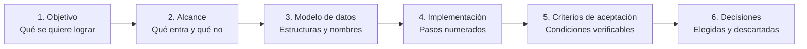

#### 1. Objetivo

Debe poder expresarse claramente en una frase.

Describe el resultado principal que se espera obtener.

#### 2. Alcance

Define explícitamente:

- Qué forma parte de la funcionalidad.
- Qué comportamientos se implementarán.
- Qué elementos quedan fuera.

Definir qué **NO** se implementará evita que el agente amplíe innecesariamente la tarea.

#### 3. Modelo de datos

Cuando sea necesario, especifica:

- Estructuras.
- Tipos.
- Propiedades.
- Nombres.
- Contratos.
- Relaciones relevantes.

#### 4. Plan de implementación

La implementación debe dividirse en pasos pequeños, secuenciales y numerados.

Cada paso debería producir un cambio suficientemente pequeño como para poder revisarse mediante un `diff`.

#### 5. Criterios de aceptación

Los criterios deben permitir comprobar de manera objetiva si la funcionalidad quedó correctamente implementada.

Evita criterios demasiado subjetivos.

Por ejemplo:

```text
El fantasma Blinky comienza a moverse inmediatamente al iniciar la partida.
```

es más verificable que:

```text
El comportamiento de Blinky debe sentirse correcto.
```

#### 6. Decisiones tomadas y descartadas

Registrar las decisiones permite conocer:

- Qué alternativa fue seleccionada.
- Qué alternativas fueron descartadas.
- Por qué se tomó determinada decisión.

Esto resulta especialmente útil cuando la `spec` debe reutilizarse después de varias semanas o sesiones.

---

### 2.2 Cuándo utilizar una Spec

No todas las tareas necesitan una especificación formal.

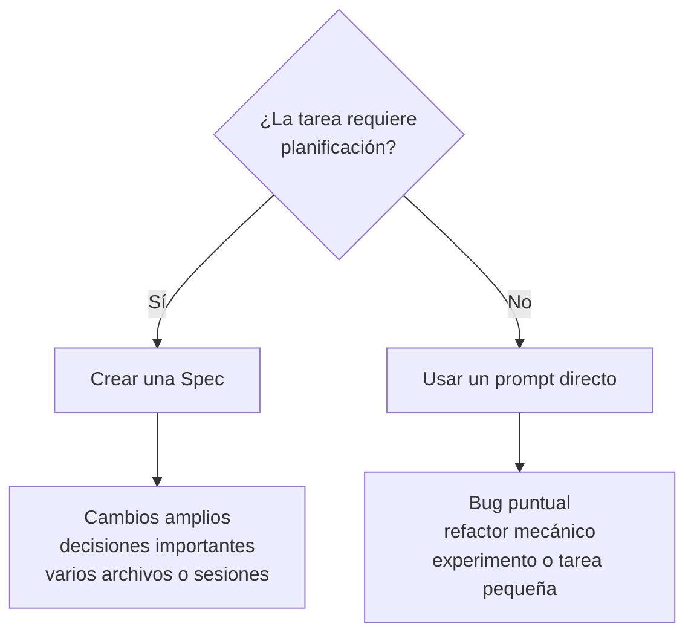

#### Conviene escribir una Spec cuando

- La funcionalidad tocará más de dos archivos.
- Existen decisiones costosas de revertir.
- Se modificarán esquemas, formatos o APIs públicas.
- Probablemente olvidarás detalles después de algunas semanas.
- El trabajo necesita más de una sesión.
- Existe un contrato que utilizarán otros artefactos.
- Otras `Skills`, agentes o `specs` dependerán de esas decisiones.
- La funcionalidad es suficientemente compleja como para necesitar planificación.

#### Conviene utilizar un prompt directo cuando

- Es un bug puntual.
- Es un refactor mecánico.
- Solo se renombrarán o moverán archivos.
- Se trata de un experimento exploratorio.
- La decisión todavía debe descubrirse mediante experimentación.
- Toda la tarea cabe claramente dentro de un único prompt.
- Es una tarea única que probablemente no vuelva a repetirse.
- Planificar requiere más esfuerzo que implementar.

---

### 2.3 Regla práctica

Una forma sencilla de decidirlo:

> Si te tienta abrir `Plan Mode`, probablemente necesites una `spec`.

> Si la funcionalidad te parece demasiado pequeña como para justificar su planificación, probablemente no la necesite.

> Si la funcionalidad es importante para el proyecto, probablemente convenga documentarla mediante una `spec`.

---

## 3. Spec + Skills + Agentes

`Specs`, `Skills` y agentes cumplen responsabilidades diferentes pero complementarias.

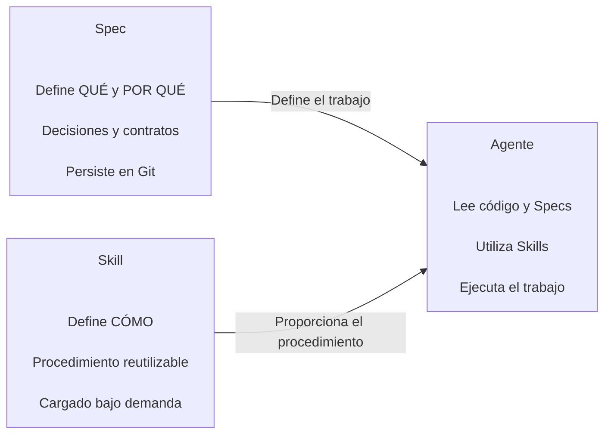

### 3.1 Spec

Una `spec`:

- Define el **qué**.
- Define el **por qué**.
- Registra decisiones de diseño.
- Define contratos.
- Es legible por humanos.
- Vive en Git.
- Persiste entre sesiones.

Ejemplo:

```text
specs/02-powerups.md
```

### 3.2 Skill

Una `Skill`:

- Define principalmente el **cómo repetible**.
- Describe un flujo de trabajo.
- Puede ser cargada cuando un agente la necesita.
- Puede servir como base para comandos o procesos recurrentes.
- Es legible por humanos.

Ejemplo conceptual:

```text
/new-powerup
```

### 3.3 Agente

Los agentes:

- Leen código.
- Consultan `specs`.
- Utilizan `Skills`.
- Toman referencias del proyecto.
- Comprenden las decisiones documentadas.
- Ejecutan las funcionalidades siguiendo esos contratos.

---

La documentación oficial de [Skills de OpenCode](https://opencode.ai/docs/skills/) describe las ubicaciones compatibles y el mecanismo de descubrimiento. El siguiente ejemplo muestra cómo crear y comprobar una Skill reutilizable.

### 3.4 Ejemplo: crear una Skill con OpenCode

#### 3.4.1 Crear la Skill

Como ejemplo se crea una Skill para consultar información de Pokémon utilizando la API pública de PokéAPI.

En modo `Plan` solicitar:

```text
Crea un skill que sirva para obtener la información de un pokemon cuando lo solicite.
Usa esta habilidad para consultar temas relacionados a Pokemon.
Para obtener la información de cada Pokemon consulta esta API: https://pokeapi.co/api/v2/pokemon
La API recibe ID o nombre del Pokemon como parámetro, por ejemplo:
https://pokeapi.co/api/v2/pokemon/1
https://pokeapi.co/api/v2/pokemon/ditto

Cualquier tema de conversación relacionado a Pokemon debe ser consultado en esta API.
```

OpenCode analizará el requerimiento y generará un plan.

Una vez aprobado el plan, cambiar a modo `Build` y solicitar su implementación.

La Skill se almacena utilizando una estructura similar a:

```text
.opencode/skills/<name>/SKILL.md
```

Para este laboratorio puede consultarse:

[.agents/skills/pokemon-info/SKILL.md](https://github.com/MLahuasi/opencode-pacman/tree/main/.agents/skills/pokemon-info/SKILL.md)

#### 3.4.2 Verificar la Skill

Después de crearla:

1. Reiniciar `OpenCode`.
2. Restaurar la sesión anterior.
3. Realizar una consulta que pueda utilizar la Skill.

Para restaurar la sesión:

```bash
# Continúa la última sesión de OpenCode.
opencode -c
```

En modo `Build`, por ejemplo:

```text
Quiero crear una tabla con la información del pokemon 4
```

OpenCode detectará que existe una Skill relacionada con Pokémon y podrá cargarla para resolver la solicitud.

Resultado:

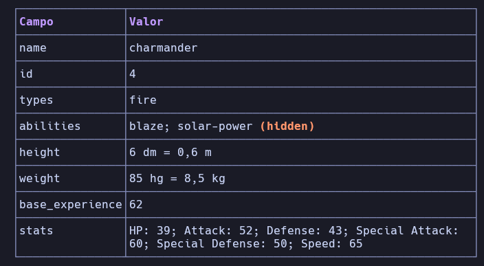

---

## 4. Preparar OpenCode para SDD

### 4.1 Configuración del proyecto

Para este laboratorio se utilizan las Skills desarrolladas por [Klerith](https://github.com/Klerith/fernando-skills/tree/main), diseñadas para trabajar con un flujo basado en `specs`.

La responsabilidad de cada Skill es diferente:

- `/spec` crea y estructura la especificación.
- `/spec-impl` implementa una especificación que ya fue revisada y aprobada.

---

### 4.2 Instalar las Skills

Ejecutar:

```bash
# Instala las Skills disponibles desde el repositorio indicado.
npx skills add klerith/fernando-skills
```

Durante la instalación:

- No es necesario seleccionar un proveedor.
- Seleccionar las dos Skills relacionadas con `spec` y `spec-impl`.

Se generará una estructura similar a:

```text
.agents/
└── skills/
    ├── spec/
    │   ├── SKILL.md
    │   └── template.md
    │
    └── spec-impl/
        └── SKILL.md
```

Cada archivo cumple una responsabilidad.

#### `.agents/skills/spec/SKILL.md`

Define el flujo utilizado para crear una especificación.

#### `.agents/skills/spec/template.md`

Define la estructura de referencia utilizada para construir una `spec`.

#### `.agents/skills/spec-impl/SKILL.md`

Define el flujo utilizado para implementar una `spec` que ya fue aprobada.

El flujo resultante puede representarse como:

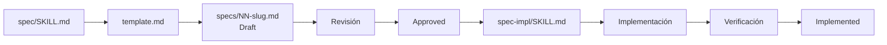

---

### 4.3 Configurar OpenCode en el proyecto

Abrir `OpenCode` desde la consola dentro del proyecto.

Ejecutar el comando integrado:

```text
/init
```

`/init` analiza el repositorio y crea o actualiza `AGENTS.md` con instrucciones del proyecto. Revisa el archivo generado antes de registrarlo.

OpenCode descubre las Skills por separado, según su ubicación, y las carga bajo demanda; no se agregan automáticamente al contenido de `AGENTS.md`. Consulta [Rules de OpenCode](https://opencode.ai/docs/rules/) y [Skills de OpenCode](https://opencode.ai/docs/skills/).

Se creará:

[AGENTS.md](https://github.com/MLahuasi/opencode-pacman/blob/main/AGENTS.md)

Registrar posteriormente el cambio en Git:

```bash
# Agrega al staging todos los archivos modificados.
git add .

# Crea un commit con la configuración inicial de OpenCode.
git commit -m "OpenCode Skills - Create Agents.md"
```

---

## 5. Protección inicial de la rama principal

Este es un paso opcional de configuración inicial del repositorio. Protege `main` para que las funcionalidades se integren mediante Pull Requests. La sección 11 describe el Pull Request que se crea por cada `spec`.

### 5.1 Publicar el repositorio

Crear primero el repositorio en GitHub y configurar el remoto.

```bash
# Vincula el repositorio local con el repositorio remoto.
git remote add origin https://github.com/MLahuasi/opencode-pacman.git

# Renombra la rama principal local como main.
git branch -M main

# Publica main y configura origin/main como rama upstream.
git push -u origin main
```

---

### 5.2 Proteger `main`

En GitHub ingresar a:

```text
Settings / Branches
```

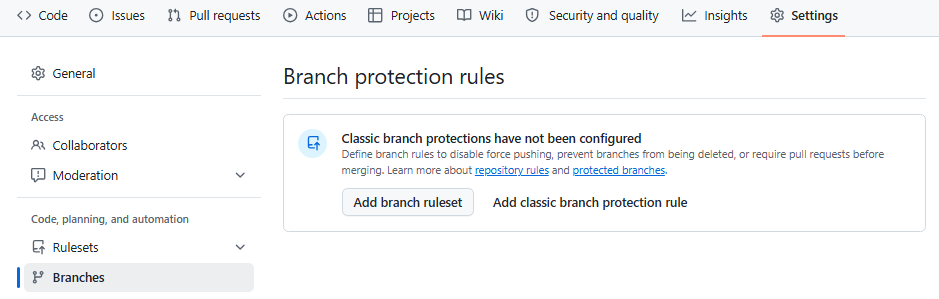

Seleccionar:

```text
Add classic branch protection rule
```

Configurar:

```text
Branch name pattern: main
```

Dentro de `Protect matching branches`:

```text
Require a pull request before merging
```

Activar:

```text
Require approvals
```

cuando se trabaja con equipos o se requiere una aprobación adicional.

También activar:

```text
Require status checks to pass before merging
```

y:

```text
Do not allow bypassing the above settings
```

Finalmente seleccionar:

```text
Create
```

A partir de este momento los cambios no deberían integrarse directamente en `main`.

Las nuevas funcionalidades deberán trabajar desde otra rama y posteriormente utilizar un Pull Request.

---

### 5.3 Crear una rama de trabajo

Ejemplo:

```bash
# Crea una nueva rama y cambia inmediatamente a ella.
git checkout -b 01-custom-skill

# Agrega todos los cambios al staging.
git add .

# Crea un commit con los cambios realizados.
git commit -m "OpenCode Skills - Custom Skills"

# Publica la rama y configura su upstream remoto.
git push -u origin 01-custom-skill
```

GitHub mostrará la posibilidad de crear un Pull Request:

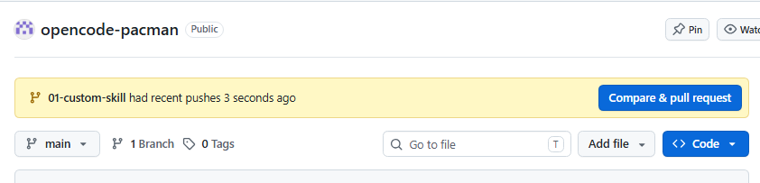

Seleccionar:

```text
Compare & pull request
```

En `Open a pull request`:

1. Verificar que aparezca `Able to merge`.
2. Agregar una descripción si es necesario.
3. Seleccionar `Create pull request`.

> **NOTA:** si el repositorio requiere aprobación, esta puede ser realizada por otro miembro del equipo o por el mecanismo de revisión definido para el proyecto.

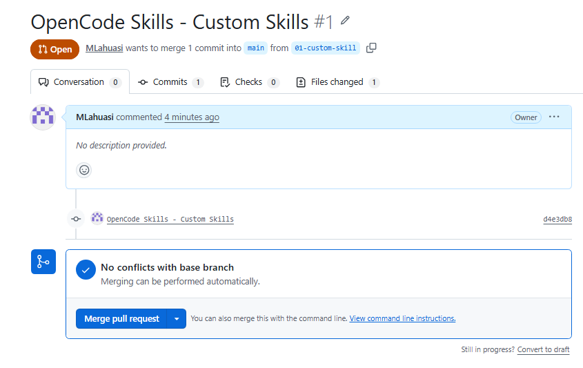

Después de aprobar los cambios:

```text
Merge pull request
```

y posteriormente:

```text
Confirm merge
```

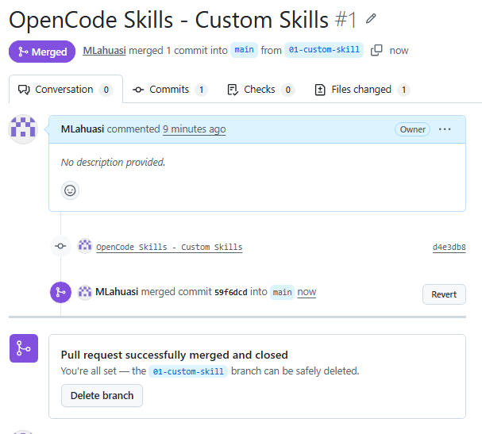

Finalmente seleccionar:

```text
Delete branch
```

---

### 5.4 Actualizar el repositorio local

Después del merge:

```bash
# Cambia nuevamente a la rama principal.
git checkout main

# Descarga e integra los cambios aprobados desde el remoto.
git pull

# Elimina la rama local que ya fue integrada.
git branch -d 01-custom-skill
```

---

## 6. Crear una Spec

Una vez configurado el proyecto puede comenzar el flujo real de Spec Driven Development.

Para el laboratorio se implementará una funcionalidad relacionada con el comportamiento de los cuatro fantasmas de Pac-Man.

---

### 6.1 Describir el problema

En modo `Plan`, ejecutar `/spec` seguido del requerimiento.

Aunque `/spec` no aparezca visualmente entre los comandos disponibles, puede invocarse directamente.

```text
/spec En PacMan existen 4 fantasmas, cada uno tiene un comportamiento propio (diferente), uno de ellos debe perseguir agresivamente a PacMan
```

El objetivo inicial describe principalmente el comportamiento deseado, no todos los detalles de implementación.

---

### 6.2 Refinar la especificación

La Skill comenzará a realizar preguntas para convertir el requerimiento inicial en decisiones concretas.

#### Comportamiento de los fantasmas

```text
¿Qué nivel de fidelidad deben tener los cuatro comportamientos?

4. Type your own answer:

(a) hunter - persigue directamente;
(b) ambusher - apunta a N celdas por delante de PacMan;
(c) patrol - alterna entre esquinas;
(d) random - aleatorio.
```

#### Nombres y colores

```text
¿Los fantasmas deben usar nombres y colores clásicos?

1. Clásico (Recommended)

Blinky rojo, Pinky rosa, Inky cian y Clyde naranja.
```

#### Fantasma agresivo

```text
¿Cómo debe perseguir el fantasma agresivo a PacMan?

1. Ruta más corta (Recommended)

En cada intersección elige el primer paso de una ruta válida.
```

#### Persecución y dispersión

```text
¿Esta spec debe incluir alternancia entre persecución y dispersión como en el arcade?

1. No incluir (Recommended)

Cada fantasma conserva su conducta propia durante toda la partida.
```

#### Salida de la guarida

```text
¿Cómo deben empezar a moverse los cuatro fantasmas desde la guarida?

4. Type your own answer

Salen escalonadamente uno a uno cada 4 segundos.
```

---

### 6.3 Refinamiento adicional

Después de las primeras respuestas pueden aparecer nuevas decisiones.

#### Relación entre nombre y comportamiento

```text
¿Qué nombre clásico corresponde a cada comportamiento?

1. Blinky/Pinky/Inky/Clyde (Recommended)

Blinky hunter,
Pinky ambusher,
Inky patrol,
Clyde random.
```

#### Distancia de emboscada

```text
¿A cuántas celdas por delante debe apuntar el fantasma ambusher?

1. 4 celdas (Recommended)

Referencia clásica y diferencia claramente la emboscada.
```

#### Comportamiento de patrulla

```text
¿Cómo alterna el fantasma patrol entre esquinas?

1. Al llegar al objetivo (Recommended)

Alterna entre esquina superior derecha e inferior izquierda al alcanzar cada destino.
```

#### Escalonamiento

```text
¿El escalonamiento debe ser Blinky inmediato y los demás a los 4, 8 y 12 segundos,
reiniciándose también después de perder una vida?

1. Sí, siempre (Recommended)

Se aplica al inicio y tras cada reposición de posiciones.
```

#### Elementos fuera del alcance

```text
¿Qué debe quedar expresamente fuera de esta spec? (select all that apply)

5. [x] Type your own answer

Todas las anteriores.
```

---

### 6.4 Decisiones finales

#### Posición inicial

```text
¿Dónde deben empezar los 4 fantasmas?

1. Todos dentro, separados (Recommended)
```

#### Orden de salida

```text
¿Confirmamos el orden Blinky 0 s, Pinky 4 s, Inky 8 s y Clyde 12 s?

1. Sí (Recommended)
```

#### Medición del tiempo

```text
¿Cómo se miden los intervalos de 4 segundos?

1. Tiempo activo real (Recommended)
```

#### Objetivos inválidos

```text
Si el objetivo de ambusher o patrol cae en un muro o no tiene ruta,
¿qué debe hacer?

1. Celda válida más cercana (Recommended)
```

Estas iteraciones convierten una solicitud relativamente ambigua en un conjunto de decisiones concretas que posteriormente pueden implementarse y verificarse.

---

## 7. Generar el archivo Spec

Una vez finalizado y aprobado el `Plan`, cambiar a modo `Build` y solicitar:

```text
Crea el spec
```

La operación debe generar los artefactos de especificación.

---

### 7.1 Configuración de Specs

La primera vez puede generarse:

[specs/.spec-config.yml](https://github.com/MLahuasi/opencode-pacman/blob/main/specs/.spec-config.yml)

Ejemplo:

```yml
AutoCreateBranch: true
```

Esta configuración controla, entre otros aspectos, si durante la implementación de una `spec` debe crearse automáticamente una rama.

---

### 7.2 Archivo de especificación

Para este laboratorio se genera:

[01-four-ghost-behaviors.md](https://github.com/MLahuasi/opencode-pacman/blob/main/specs/01-four-ghost-behaviors.md)

El nombre y contenido cambiarán dependiendo de la funcionalidad.

La estructura general será similar a:

```text
specs/
├── .spec-config.yml
└── 01-four-ghost-behaviors.md
```

> **IMPORTANTE:** durante esta fase solo debe crearse la `spec`. No deben implementarse todavía cambios en el código fuente.

Esta separación es fundamental:

```text
Diseñar → Revisar → Aprobar → Implementar
```

y no:

```text
Diseñar + implementar simultáneamente
```

---

## 8. Aprobar la Spec

Antes de comenzar la implementación se debe revisar manualmente:

[01-four-ghost-behaviors.md](https://github.com/MLahuasi/opencode-pacman/blob/main/specs/01-four-ghost-behaviors.md)

Verificar principalmente:

- Objetivo.
- Alcance.
- Elementos fuera del alcance.
- Decisiones.
- Plan de implementación.
- Criterios de aceptación.

Si la especificación cumple con lo solicitado, cambiar su estado a:

```md
> **Status:** Approved
```

La aprobación representa la transición entre la fase de diseño y la fase de ejecución.

---

## 9. Implementar una Spec

Con la especificación aprobada, cambiar a modo `Build` y ejecutar:

```text
/spec-impl specs/01-four-ghost-behaviors.md
```

La Skill `spec-impl` utilizará la especificación aprobada como contrato de implementación.

---

### 9.1 Creación de la rama

Si está configurado:

```yml
AutoCreateBranch: true
```

se crea automáticamente una nueva rama para agrupar todos los cambios correspondientes a la `spec`.

Por ejemplo:

```text
spec-01-four-ghost-behaviors
```

Esto permite aislar completamente la funcionalidad de `main`.

---

### 9.2 Cambiar el IDE a la rama

Si OpenCode crea la rama desde otro contexto o `worktree`, el IDE debe trabajar sobre la rama correcta antes de revisar o modificar los archivos.

```bash
# Cambia el repositorio actual a la rama creada para implementar la spec.
git switch spec-01-four-ghost-behaviors

# Muestra los worktrees existentes y las ramas asociadas.
git worktree list
```

---

### 9.3 Implementación paso a paso

OpenCode ejecutará secuencialmente los puntos definidos dentro de:

[01-four-ghost-behaviors.md](https://github.com/MLahuasi/opencode-pacman/blob/main/specs/01-four-ghost-behaviors.md)

El flujo recomendado es:

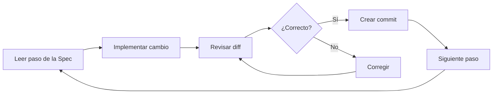

Es importante revisar los cambios a medida que el agente completa cada paso.

Esto evita acumular errores y permite mantener cada modificación claramente relacionada con el punto correspondiente de la `spec`.

#### Crear un commit por cada paso completado

Cuando un cambio correspondiente a un paso de la `spec` haya sido:

1. Implementado.
2. Revisado mediante su `diff`.
3. Validado como correcto.

se recomienda crear inmediatamente un `commit`.

Si para implementar la `spec` se creó una rama específica, estos commits deben realizarse dentro de esa rama.

Por ejemplo:

```bash
# Agrega al staging los cambios correspondientes al paso implementado.
git add .

# Registra el cambio correspondiente al paso completado.
git commit -m "Implement ghost release timing"
```

Después se continúa con el siguiente paso de la `spec`.

El flujo sería:

```text
Paso 1
  ↓
Implementar
  ↓
Revisar diff
  ↓
Validar
  ↓
Commit
  ↓
Paso 2
  ↓
Implementar
  ↓
Revisar diff
  ↓
Validar
  ↓
Commit
  ↓
...
```

Esto permite que cada `commit` represente una unidad de cambio concreta y facilita:

- Revisar la evolución de la implementación.
- Relacionar los commits con los pasos de la `spec`.
- Detectar dónde se introdujo un problema.
- Revertir un cambio específico sin afectar toda la funcionalidad.
- Revisar posteriormente el Pull Request mediante cambios pequeños y comprensibles.

> **IMPORTANTE:** el `commit` debe realizarse después de revisar y validar el cambio, no simplemente después de que el agente termine de modificar los archivos.

#### Verificar el estado antes de finalizar

Una vez completados todos los pasos de la `spec`, comprobar que no existan cambios pendientes:

```bash
# Muestra el estado actual del repositorio.
git status
```

Idealmente, todos los cambios deberían haber sido registrados durante la implementación paso a paso.

Si existen cambios pendientes, se debe revisar primero por qué no fueron incluidos en alguno de los commits anteriores.

Si corresponden legítimamente a la implementación de la `spec`, revisarlos y registrarlos antes de continuar con la validación final:

```bash
# Agrega al staging los cambios pendientes que ya fueron revisados.
git add .

# Registra los cambios pendientes antes de finalizar la implementación.
git commit -m "Complete pending spec changes"
```

Este último commit debería ser excepcional. El flujo recomendado es registrar los cambios conforme se completa cada paso de la `spec`.

Antes de pasar a la validación final, la rama debería quedar limpia:

```text
git status
↓
Working tree clean
↓
Continuar con la validación de la Spec
```

Si durante la ejecución aparece una modificación que cambia decisiones importantes de diseño, conviene regresar a la fase de planificación y modificar la `spec` antes de continuar.

---

## 10. Validar y cerrar la Spec

Cuando todos los pasos han terminado, solicitar la validación final de la implementación.

La revisión debe comprobar que:

- Los pasos definidos fueron implementados.
- Los criterios de aceptación se cumplen.
- No existen cambios fuera del alcance.
- El código funciona según la especificación.
- No existen modificaciones inesperadas.

Si la validación es correcta, la `spec` puede cerrarse como implementada.

Conceptualmente:

```text
Draft
  ↓
Approved
  ↓
Implementation
  ↓
Validation
  ↓
Implemented
```

---

## 11. Integrar mediante Pull Request

Publicar la rama:

```bash
# Publica la rama de la spec en GitHub y configura su upstream.
git push -u origin spec-01-four-ghost-behaviors
```

En GitHub:

1. Crear el Pull Request.
2. Revisar los cambios.
3. Comprobar los criterios definidos en la `spec`.
4. Aprobar el Pull Request.
5. Ejecutar el merge.
6. Eliminar la rama remota.

Después del merge, actualizar el repositorio local:

```bash
# Regresa a la rama principal.
git checkout main

# Descarga e integra la versión más reciente de main.
git pull

# Elimina la rama local que ya fue integrada.
git branch -d spec-01-four-ghost-behaviors
```

---

## 12. Flujo completo de SDD utilizado en el laboratorio

El proceso completo utilizado en `opencode-pacman` puede resumirse así:

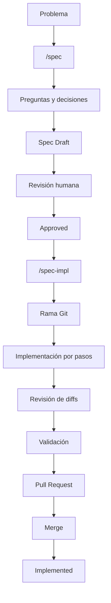

La idea principal es que el agente no pase directamente desde una solicitud a una gran implementación.

En cambio:

```text
Problema
   ↓
Planificación
   ↓
Decisiones
   ↓
Spec
   ↓
Aprobación humana
   ↓
Implementación incremental
   ↓
Revisión
   ↓
Validación
   ↓
Integración
```

---

## 13. Principios principales

A partir del laboratorio se pueden resumir varios principios de trabajo.

### La conversación no debe ser la única fuente de contexto

Las decisiones importantes deben persistir dentro del repositorio.

Una `spec` permite conservarlas aunque:

- Cambie la sesión.
- Se compacte el contexto.
- Otro agente continúe el trabajo.
- Otro desarrollador implemente la funcionalidad.

### La Spec funciona como contrato

La implementación debe respetar lo definido en la especificación aprobada.

Si una decisión importante cambia, primero debe actualizarse la especificación.

### Los cambios deben ser pequeños

Implementar paso a paso permite:

- Revisar mejor.
- Comprender cada modificación.
- Detectar errores antes.
- Revertir cambios con mayor facilidad.

### Las Skills permiten reutilizar procedimientos

No es necesario volver a explicar en cada conversación cómo crear o implementar una `spec`.

Ese procedimiento puede persistir como una `Skill`.

### Git proporciona trazabilidad

Las ramas, commits, `diffs` y Pull Requests permiten relacionar:

```text
Spec
  ↓
Implementación
  ↓
Cambios
  ↓
Revisión
  ↓
Integración
```

### El humano mantiene el control de las decisiones

El agente puede:

- Analizar.
- Proponer.
- Preguntar.
- Implementar.
- Validar.

Pero las decisiones importantes de alcance y diseño deben aprobarse antes de modificar el sistema.

---

## 14. Modelo mental

Una forma sencilla de entender la relación entre los componentes es:

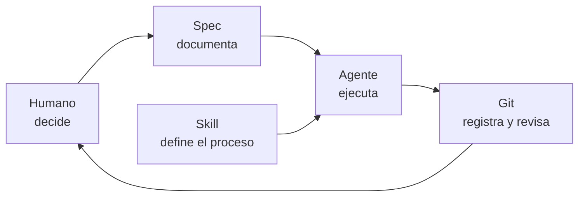

En este modelo:

- **El humano decide.**
- **La `spec` conserva las decisiones.**
- **La `Skill` define cómo ejecutar un procedimiento repetible.**
- **El agente implementa siguiendo esas instrucciones.**
- **Git registra los cambios y permite revisarlos antes de integrarlos.**

Este flujo convierte una conversación con un agente en un proceso de desarrollo más estructurado, reproducible y verificable.
