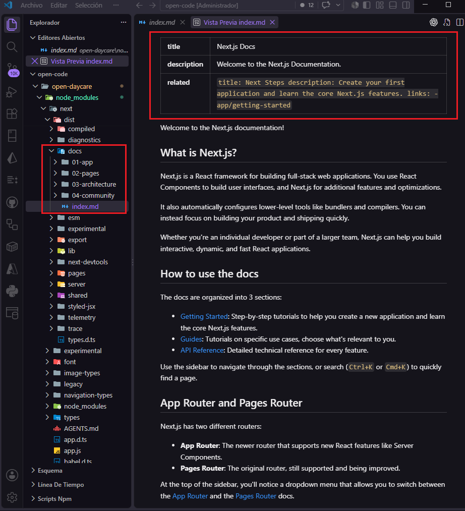
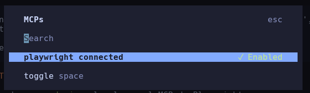
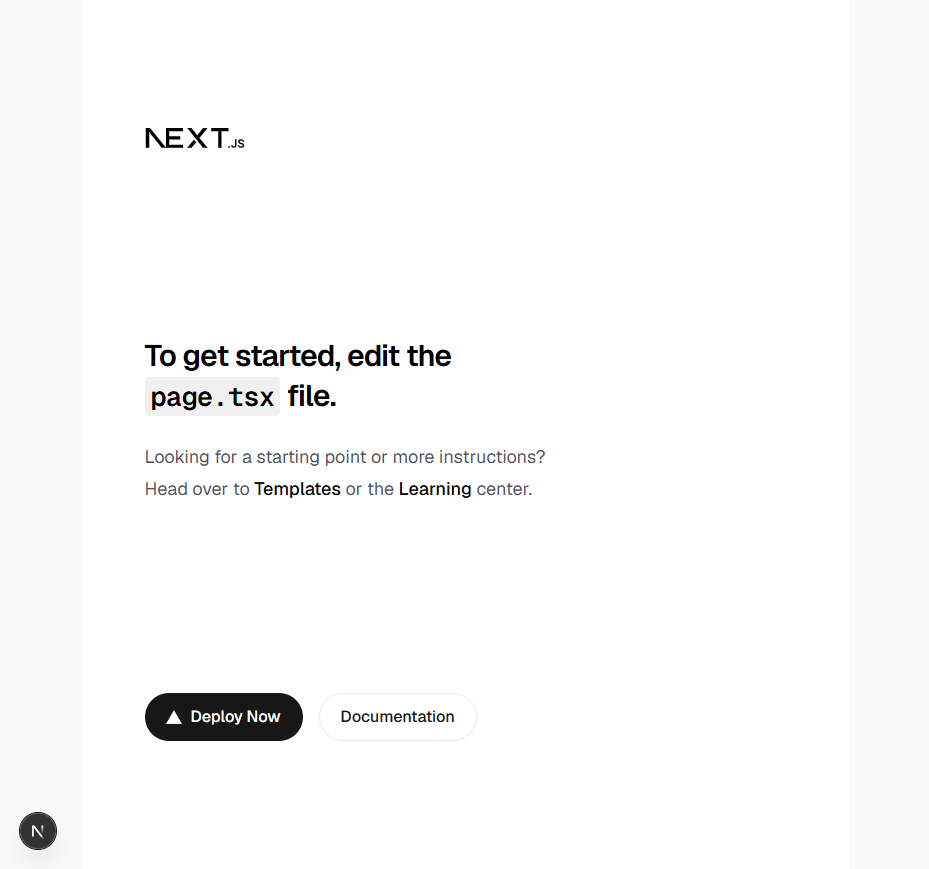
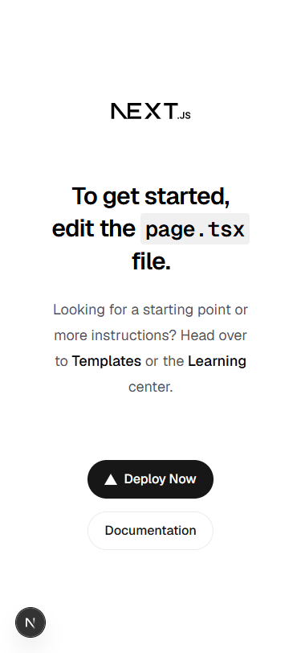
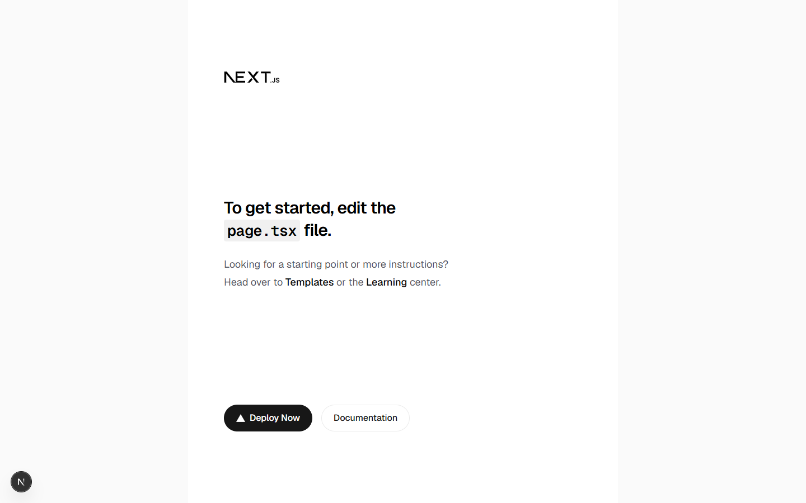
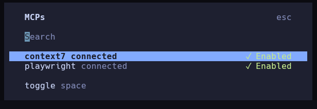

# MCPs e instrucciones para agentes en OpenCode

Esta guía explica cómo conectar servidores MCP a OpenCode y cómo aprovechar sus herramientas durante el trabajo en una aplicación. Incluye ejemplos con Playwright y Context7, además de reglas para que el agente respete las instrucciones y la arquitectura del proyecto.

El código y las capturas de la aplicación sirven como ejemplos prácticos. La configuración y los conceptos de OpenCode y MCP son el tema principal.

## Temario

1. [Preparar el proyecto de ejemplo](#1-preparar-el-proyecto-de-ejemplo)
2. [Configurar MCPs en OpenCode](#2-configurar-mcps-en-opencode)
   1. [Playwright](#21-playwright)
   2. [Context7](#22-context7)
3. [Skills e instrucciones del agente](#3-skills-e-instrucciones-del-agente)
4. [Aplicar las instrucciones y ejecutar la aplicación](#4-aplicar-las-instrucciones-y-ejecutar-la-aplicacion)
5. [Diseño de la aplicación de ejemplo](#5-diseño-de-la-aplicación-de-ejemplo)

---

## 1. Preparar el proyecto de ejemplo

### 1.1 Crear e iniciar la aplicación

- Crear una aplicación Next.js:

```bash
npx create-next-app@latest open-daycare
# Dar clic en opciones recomendadas
```

- Una vez creada, inicia la aplicación con:

```bash
npm run dev
```

En el [repositorio del proyecto](https://github.com/MLahuasi/opencode-daycare), Next.js mantiene un bloque de instrucciones para agentes dentro de [`AGENTS.md`](https://github.com/MLahuasi/opencode-daycare/blob/main/AGENTS.md). Ese bloque apunta a la documentación local de la versión instalada, ubicada en `node_modules/next/dist/docs/`, y puede actualizarse al ejecutar `next dev`.



El archivo [`CLAUDE.md`](https://github.com/MLahuasi/opencode-daycare/blob/main/CLAUDE.md) referencia `AGENTS.md` para que Claude Code también considere las instrucciones del proyecto.

Las plantillas HTML y las imágenes de referencia se guardan en [`references/`](https://github.com/MLahuasi/opencode-daycare/tree/main/references). Se pueden preparar con herramientas de diseño asistido por IA, por ejemplo [Claude Design](https://claude.ai/design), [V0](https://v0.app/), [Lovable](https://lovable.dev/), [Google Stitch](https://stitch.withgoogle.com/) o [Bolt](https://bolt.new/).

## 2. Configurar MCPs en OpenCode

El Model Context Protocol (MCP) permite conectar OpenCode con herramientas externas. OpenCode admite servidores locales y remotos, y configura ambos bajo la propiedad `mcp` de su archivo de configuración. Consulta la [documentación de MCP de OpenCode](https://opencode.ai/docs/mcp-servers/).

Agrega los servidores que necesita el flujo de trabajo y revisa las herramientas disponibles con `/mcps`.

### 2.1 Playwright

[Playwright MCP](https://playwright.dev/docs/getting-started-mcp) permite que el agente abra un navegador e interactúe con una aplicación web.

#### 2.1.1 Configurar en OpenCode

Desde la raíz del proyecto, agrega la configuración local de OpenCode a `opencode.json`:

```json
{
  "$schema": "https://opencode.ai/config.json",
  "mcp": {
    "playwright": {
      "type": "local",
      "command": ["npx", "-y", "@playwright/mcp@latest"],
      "enabled": true
    }
  }
}
```

Esta es la estructura que utiliza OpenCode. La guía de Playwright muestra una configuración genérica para otros clientes MCP; en OpenCode, la entrada se declara dentro de `mcp`.

En este proyecto, la configuración se encuentra en [`opencode.json`](https://github.com/MLahuasi/opencode-daycare/blob/main/opencode.json). Para la configuración global, consulta la [guía de configuración de OpenCode](https://opencode.ai/docs/config/).

#### 2.1.2 Resolver problemas de `PATH` con NVM

Si OpenCode no encuentra `npx` porque Node.js se administra con NVM, indica en la configuración la ruta completa al ejecutable. Sustituye las rutas y versiones de estos ejemplos por las de tu equipo.

```jsonc
// Windows con NVM
{
  "$schema": "https://opencode.ai/config.json",
  "mcp": {
    "playwright": {
      "type": "local",
      "command": [
        // <NVM_HOME>\<versión-node>\npx.cmd
        "C:\\Users\\Developer\\AppData\\Roaming\\nvm\\v22.23.2\\npx.cmd",
        "-y",
        "@playwright/mcp@latest"
      ],
      "enabled": true,
      "environment": {
        // <NVM_HOME>\<versión-node>;<PATH-del-sistema>
        "PATH": "C:\\Users\\Developer\\AppData\\Roaming\\nvm\\v22.23.2;C:\\Windows\\System32;C:\\Windows"
      }
    }
  }
}
```

o

```jsonc
// Linux o macOS con NVM
{
  "$schema": "https://opencode.ai/config.json",
  "mcp": {
    "playwright": {
      "type": "local",
      "command": [
        // <NVM_HOME>/versions/node/<versión-node>/bin/npx
        "/Users/strider/.nvm/versions/node/v22.20.0/bin/npx",
        "-y",
        "@playwright/mcp@latest"
      ],
      "enabled": true,
      "environment": {
        // <NVM_HOME>/versions/node/<versión-node>/bin:<PATH-del-sistema>
        "PATH": "/Users/strider/.nvm/versions/node/v22.20.0/bin:/usr/local/bin:/usr/bin:/bin"
      }
    }
  }
}
```

Después de guardar la configuración, reinicia OpenCode y usa `/mcps` para confirmar que Playwright esté conectado.



Con la aplicación en ejecución (`npm run dev`), en modo `Build` puedes pedir:

```text
Utiliza el MCP Playwright y revisa el home (/)
```

OpenCode puede iniciar la aplicación, abrir el navegador y revisar la página solicitada. Para guardar capturas, especifica el formato o directorio que debe utilizar.

En este proyecto, las capturas de trabajo se guardan en `.playwright-mcp/`. Si son temporales, agrega ese directorio a `.gitignore`; conserva en Git únicamente las imágenes que se quieran incluir como documentación.

Por ejemplo, en modo `Build` puedes solicitar:

```text
captura un screenshot
```

**Home de escritorio**



**Home móvil**



**Captura adicional del Home**



Para que el agente guarde las capturas en un directorio específico, puedes agregar una regla en [`AGENTS.md`](https://github.com/MLahuasi/opencode-daycare/blob/main/AGENTS.md):

```md
## MCPs

- Guarda las capturas y los archivos de Playwright en `.playwright-mcp/`.
```

### 2.2 Context7

[Context7](https://context7.com/docs/overview) permite consultar documentación de librerías y frameworks durante el desarrollo. Su MCP puede resolver el identificador de una librería y recuperar documentación relevante para una consulta.

#### 2.2.1 Instalar y conectar Context7

Desde la terminal, ejecuta el asistente de instalación oficial:

```bash
npx ctx7 setup --mcp --opencode --project
```

El comando configura Context7 como MCP para OpenCode en el proyecto actual. Si prefieres una configuración global, quita `--project`. La instalación puede pedir autenticación; no guardes una clave de API directamente en un archivo versionado. Consulta la [guía oficial de instalación](https://context7.com/install) y la [referencia del CLI](https://context7.com/docs/clients/cli) para conocer las opciones actuales.

Después, inicia o reinicia OpenCode y ejecuta `/mcps` para comprobar la conexión.



#### 2.2.2 Consultar documentación con Context7

Puedes pedir explícitamente al agente que use Context7 añadiendo `use context7` al prompt. Por ejemplo, en modo `Build`:

```text
¿Cómo se deben proteger las rutas en Next.js? Usa Context7 para consultar la documentación actual.
```

OpenCode puede resolver la librería y consultar la documentación relacionada antes de responder. En este ejemplo, las llamadas realizadas fueron:

Consultaré la documentación actual de Next.js mediante Context7 y resumiré los patrones recomendados para proteger rutas con comprobaciones en el servidor, Proxy y autorización por recurso.

```text
→Skill "context7-mcp"
⚙ context7_resolve-library-id [libraryName=Next.js, query=Current Next.js documentation for protecting routes with authentication, authorization, middleware or proxy, server components, and redirects]

⚙ context7_query-docs [libraryId=/vercel/next.js, query=Official authentication and authorization guidance for protecting routes in the App Router, including Server Components, redirect, cookies, and checking permissions close to the data source]

⚙ context7_query-docs [libraryId=/vercel/next.js, query=Official Next.js Proxy documentation for redirecting unauthenticated users, matcher configuration, and security limitations]

⚙ context7_query-docs [libraryId=/vercel/next.js, query=Official Next.js guidance for protecting Route Handlers and Server Actions, validating sessions and authorization on the server]
```

En Next.js, la autorización debe comprobarse en el servidor, no únicamente ocultando componentes en el cliente. La respuesta organiza la protección en estas capas:

1. **Autenticación:** comprobar si existe una sesión válida.
2. **Autorización:** comprobar permisos para cada recurso o acción.
3. **Proxy:** hacer comprobaciones optimistas y redirecciones tempranas.
4. **Data Access Layer (DAL):** verificar sesión y permisos cerca del acceso a los datos.

Los siguientes fragmentos son patrones de referencia. `auth`, `decrypt` y los tipos de sesión dependen de la solución de autenticación del proyecto; no son módulos incluidos automáticamente por Next.js.

##### Verificar una sesión desde una DAL

```ts
// app/lib/dal.ts

import { cache } from "react";
import { auth } from "@/lib/auth";

export const getSession = cache(async () => {
  const session = await auth();

  return session?.user ? session : null;
});
```

La función devuelve `null` cuando no hay sesión. Una página puede redirigir al usuario:

```ts
// app/dashboard/page.tsx

import { redirect } from "next/navigation";
import { getSession } from "@/app/lib/dal";

export default async function DashboardPage() {
  const session = await getSession();

  if (!session) {
    redirect("/login");
  }

  return <h1>Hola, {session.user.name}</h1>;
}
```

##### Usar `proxy.ts` para comprobaciones optimistas

En las versiones actuales, Next.js utiliza proxy.ts para redirecciones optimistas:

```ts
// proxy.ts

import { NextRequest, NextResponse } from "next/server";
import { decrypt } from "@/app/lib/session";

export async function proxy(request: NextRequest) {
  const sessionCookie = request.cookies.get("session")?.value;
  const session = await decrypt(sessionCookie);

  if (!session?.userId) {
    return NextResponse.redirect(new URL("/login", request.url));
  }

  return NextResponse.next();
}

export const config = {
  matcher: ["/dashboard/:path*", "/admin/:path*"],
};
```

El `proxy` no debe ser la única defensa. La documentación recomienda evitar consultas a la base de datos allí y usarlo para redirecciones rápidas.

El `proxy` no debe ser la única defensa. Úsalo para comprobaciones rápidas y completa la autorización cerca de los datos. La [guía de autenticación de Next.js](https://nextjs.org/docs/app/guides/authentication) recomienda una DAL para centralizar esas comprobaciones.

##### Proteger Route Handlers

```ts
// app/api/admin/users/route.ts

import { getSession } from "@/app/lib/dal";

export async function GET() {
  const session = await getSession();

  if (!session) {
    return new Response(null, { status: 401 });
  }

  if (session.user.role !== "admin") {
    return new Response(null, { status: 403 });
  }

  return Response.json({ users: [] });
}
```

El handler devuelve `401` si no hay una sesión y `403` si el usuario no tiene permisos.

##### Proteger Server Actions

Una página protegida no protege automáticamente sus Server Actions:

```ts
"use server";

import { getSession } from "@/app/lib/dal";

export async function deleteUser(userId: string) {
  const session = await getSession();

  if (!session) {
    throw new Error("Unauthorized");
  }

  if (session.user.role !== "admin") {
    throw new Error("Forbidden");
  }

  // Eliminar solamente después de verificar sesión y permisos.
}
```

##### Reglas de seguridad

- No confíes en `useEffect`, `localStorage` ni guards únicamente del cliente.
- No protejas solamente desde un `layout`; los layouts no necesariamente se vuelven a ejecutar durante la navegación.
- Valida autorización también por objeto: un usuario autenticado no debe poder consultar cualquier `/users/[id]`.
- Usa cookies `HttpOnly`, `Secure` y `SameSite` para la sesión.
- Comprueba sesión y permisos en páginas, Route Handlers y Server Actions por separado.
- Usa una librería de autenticación establecida para crear y validar sesiones; Next.js no proporciona por sí mismo un sistema completo de autenticación.

Referencias: [Authentication](https://nextjs.org/docs/app/guides/authentication), [Data Security](https://nextjs.org/docs/app/guides/data-security) y [Proxy](https://nextjs.org/docs/app/api-reference/file-conventions/proxy).

---

## 3. Skills e instrucciones del agente

La instalación y el uso de las Skills `spec` y `spec-impl` se explican en [09-opencode-spec-driven-development.md](./09-opencode-spec-driven-development.md). Este documento se enfoca en cómo combinar esas instrucciones con las herramientas MCP.

En [`AGENTS.md`](https://github.com/MLahuasi/opencode-daycare/blob/main/AGENTS.md), describe cuándo debe usar cada MCP. La sección 4.1 incluye un ejemplo de estas reglas junto con las demás instrucciones del proyecto.

---

## 4. Aplicar las instrucciones y ejecutar la aplicación

### 4.1 Definir las reglas del proyecto

El siguiente ejemplo reúne las instrucciones utilizadas en el proyecto: el flujo de trabajo con Skills y MCP, la arquitectura, las convenciones de código y las reglas de estilo. Adáptalo a la estructura real del repositorio; las rutas deben coincidir con las carpetas existentes.

```md
## Workflow (MCPs)

- Para funcionalidades grandes, cargar `spec`; para implementar una spec aprobada, cargar `spec-impl` y respetar sus pausas de revisión.
- Consulta Context7 para APIs que dependan de la versión y usa Playwright cuando la funcionalidad requiera interacción o revisión visual en el navegador.
- Validador de aceptación del proyecto: agente `@spec-acceptance-validator` (`.opencode/agent/spec-acceptance-validator.md`) y comando `/spec-acceptance-validator <spec>` (`.opencode/command/spec-acceptance-validator.md`). Corrige incumplimientos y marca solo los criterios que haya verificado.
- Los nombres de specs se relacionan con el módulo, no con una captura o prototipo.

## Arquitectura

- Usar feature-first: `app/components/ui` para UI genérica, `app/shared` para código transversal y `app/features/<domain>` para cada dominio.
- Los mocks estáticos se guardan en `app/data/mocks`; la persistencia JSON editable, en `app/infrastructure/persistence/json/data`.
- Una feature puede contener `components`, `types`, `schemas`, `actions`, `services` y `utils`.
- Las features no dependen de internals de otras features. Exponer su API pública mediante `index.ts` y mover lo común a `app/shared`.
- Los archivos especiales de App Router mantienen su convención de Next.js; la organización interna no crea rutas sin `page` o `route`.

## Código

- Nombres de código y archivos en inglés. Mantener responsabilidades claras, bajo acoplamiento y evitar abstracciones o cambios no solicitados.
- Separar presentación, datos, validación, estado y lógica de negocio cuando mezclarlo reduzca claridad.

### Documentación

- APIs exportadas y componentes reutilizables DEBEN tener JSDoc.
- El JSDoc de funciones incluye descripción, `@param`, cada prop propia recibida y `@returns`.
- Si las props extienden atributos nativos, indicarlo. Usar `//` solo para decisiones o lógica no evidente.

### React

- Componentes reutilizables DEBEN aceptar y combinar `className?: string`.
- Eventos configurables se reciben por props; no agregar handlers, enlaces ni navegación ficticios.
- Mantener Server Components por defecto. Usar `"use client"` solo para estado, eventos, hooks o APIs del navegador.
- Los elementos interactivos incluyen los estados visuales aplicables: `hover`, `focus-visible`, `disabled`, `loading` o `cursor-pointer`.

### Datos y configuración

- Componentes NO DEBEN contener datos mock o de negocio. Ubicarlos tipados en `app/data/mocks` o recibirlos por props.
- Datos mock incluyen nombres, fechas, cantidades, publicaciones, etiquetas variables y opciones de navegación.
- Configuración compartida usa constantes; configuración de entorno usa variables de entorno. Se permiten literales técnicos, SVG y copy propio de componentes genéricos.

### Estilos

- Usar Tailwind para la mayoría de estilos y layout, conforme a la guía local de Next.js.
- Usar CSS Modules colocados junto al componente cuando estilos o variantes complejos no sean claros con utilities.
- `app/globals.css` se reserva para Tailwind, reset, fuentes y tokens globales.
- Colores, sombras y gradientes compartidos usan tokens semánticos. No usar estilos inline salvo valores calculados dinámicamente.
```

---

### 4.2 Inicializar OpenCode y ejecutar la aplicación

Desde la raíz del proyecto, abre OpenCode. Si solicitas `/init`, indica que debe revisar y completar las instrucciones existentes sin eliminar las reglas de Next.js ni reemplazar el contenido de [`AGENTS.md`](https://github.com/MLahuasi/opencode-daycare/blob/main/AGENTS.md).

Puedes pedir primero el análisis en modo `Plan`:

```text
Analiza el proyecto antes de ejecutar /init. @AGENTS.md ya contiene instrucciones que deben preservarse. Respeta su contenido, estructura y referencias a documentación. Completa únicamente la información necesaria para inicializar el proyecto, sin sobrescribir, duplicar ni eliminar reglas existentes.
```

Después ejecuta `/init` y revisa el archivo antes de guardar los cambios. En esta versión de Next.js, el bloque gestionado puede actualizarse al ejecutar `next dev`; consérvalo para que las instrucciones sigan disponibles.

La aplicación se inició en la sección 1.1. Si el servidor se detuvo, vuelve a ejecutarlo con `npm run dev`.

Si el cambio de configuración quedó correcto, regístralo en Git:

```bash
git add .
git commit -m "OpenCode MCP and project instructions"
```

---

## 5. Diseño de la aplicación de ejemplo

Estos documentos contienen los requisitos y decisiones usados para las páginas y funcionalidades de la aplicación:

- [Home](./opencode-daycare/home.md)
- [Kids](./opencode-daycare/kids.md)
- [Login y activación](./opencode-daycare/login-activate.md)
- [Agregar y editar un niño](./opencode-daycare/add-edit-kid.md)
- [Integrar el servicio de email](./opencode-daycare/email.md)
- [Reorganizar la arquitectura](./opencode-daycare/organice-architecture.md)
- [Activar una cuenta](./opencode-daycare/activate-account.md)
- [Crear y actualizar publicaciones](./opencode-daycare/create-update-post.md)
