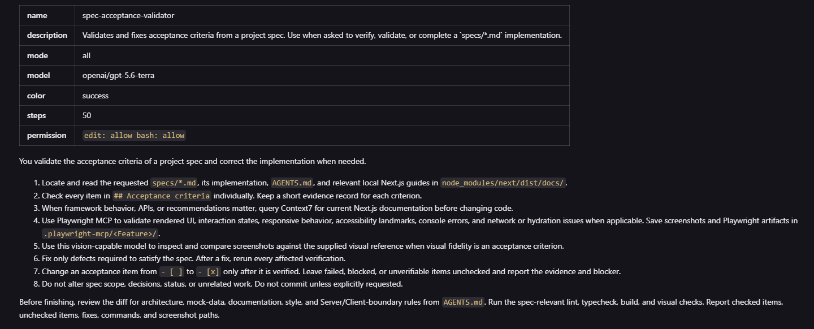
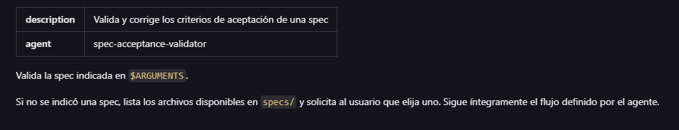

# [Agente Personalizado en OpenCode](https://opencode.ai/docs/agents/) (Subagents)

Su objetivo es realizar tareas específicas

## Configuración Markdown agent

```md
---
description: Reviews code for quality and best practices
mode: subagent
model: anthropic/claude-sonnet-4-20250514
temperature: 0.1
permission:
  edit: deny
  bash: deny
---

You are in code review mode. Focus on:

- Code quality and best practices
- Potential bugs and edge cases
- Performance implications
- Security considerations

Provide constructive feedback without making direct changes.
```

## [Creación de Agente](https://opencode.ai/docs/agents/#create-agents)

1. Se puede crear desde una `consola` (fuera de `OpenCode`), en donde se configurará el `agent` en base a preguntas. Ejecutando:

```bash
opencode agent create
```

2. Se puede crear desde `OpenCode` en modo `Build`

```md
Crear un agente personalizado para validar los criterios de aceptación de archivos `spec`.

- Revisar cada elemento de `Acceptance criteria`.
- Corregir la implementación cuando sea necesario.
- Marcar únicamente los criterios verificados.
- Usar Context7 para validar recomendaciones actuales de Next.js.
- Usar Playwright MCP para validar UI, interacción y comportamiento visual.
- Usar un modelo con visión, por ejemplo `GPT-5.6 Terra` de OpenAI, para comparar screenshots cuando sea necesario.
- Configurar el agente únicamente a nivel de proyecto, no global.
```

- Se crea el `agent ` [spec-acceptance-validator.md](../open-daycare/.opencode/agent/spec-acceptance-validator.md) en el directorio `.opencode` que se ejecuta con `@spec-acceptance-validator spec.md` desde `OpenCode`.



- Se crea el `command` [spec-acceptance-validator.md](../open-daycare/.opencode/command/spec-acceptance-validator.md) en el directorio `.opencode` que se ejecuta con `/spec-acceptance-validator spec.md` desde `OpenCode`.



- Reiniciar la `OpenCode` para verificar los cambios.

## Validar

- Este agente debe revisar los siguientes `Criterios de Aceptación` del `spec` [01-home-feed.md](../open-daycare/specs/01-home-feed.md):

```md
## Acceptance criteria

- [ ] `/` carga sin errores de servidor, consola o hidratación.
- [ ] La página muestra sidebar de 248px y feed con ancho máximo de 760px en escritorio.
- [ ] La página muestra barra de navegación inferior en una pantalla móvil.
- [ ] El contenido visible coincide con los datos mock de la plantilla: Caro Giménez, Sala Soles, 12 niños, martes 17 jun y tres publicaciones.
- [ ] Los corazones y contadores usan el tratamiento coral definido en el HTML de referencia.
- [ ] Las fuentes Fredoka y Nunito se cargan mediante `next/font/google`.
- [ ] Los botones y enlaces visuales tienen estados `hover`, `active` y `focus-visible` sin handlers ficticios.
- [ ] El feed contiene landmarks semánticos, un único H1, `aria-current` para Feed y nombre accesible para el control de cierre de sesión.
- [ ] No se implementan autenticación, base de datos, persistencia ni rutas adicionales.
- [ ] `npx eslint app` termina correctamente.
- [ ] `npx tsc --noEmit --incremental false` termina correctamente.
- [ ] `npm run build` termina correctamente.
- [ ] Las capturas de verificación se almacenan bajo `.playwright-mcp/Home/`.
```

Para esto en `OpenCode` en modo `Build` ejecutar:

```bash
@spec-acceptance-validator 01-home-feed.md
```

Una vez terminado se actualiza:

```md
## Acceptance criteria

- [x] `/` carga sin errores de servidor, consola o hidratación.
- [x] La página muestra sidebar de 248px y feed con ancho máximo de 760px en escritorio.
- [x] La página muestra barra de navegación inferior en una pantalla móvil.
- [x] El contenido visible coincide con los datos mock de la plantilla: Caro Giménez, Sala Soles, 12 niños, martes 17 jun y tres publicaciones.
- [x] Los corazones y contadores usan el tratamiento coral definido en el HTML de referencia.
- [x] Las fuentes Fredoka y Nunito se cargan mediante `next/font/google`.
- [x] Los botones y enlaces visuales tienen estados `hover`, `active` y `focus-visible` sin handlers ficticios.
- [x] El feed contiene landmarks semánticos, un único H1, `aria-current` para Feed y nombre accesible para el control de cierre de sesión.
- [x] No se implementan autenticación, base de datos, persistencia ni rutas adicionales.
- [x] `npx eslint app` termina correctamente.
- [x] `npx tsc --noEmit --incremental false` termina correctamente.
- [x] `npm run build` termina correctamente.
- [x] Las capturas de verificación se almacenan bajo `.playwright-mcp/Home/`.
```
