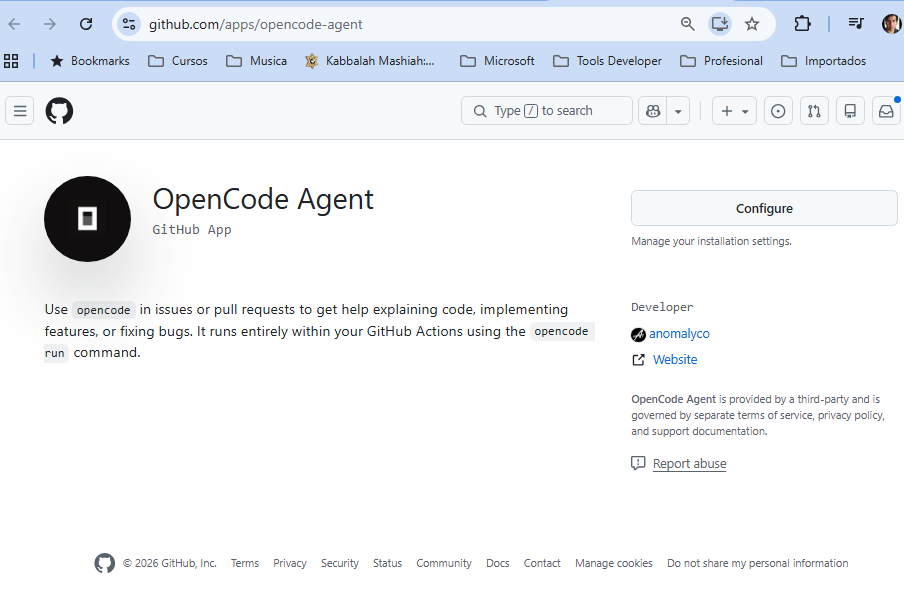
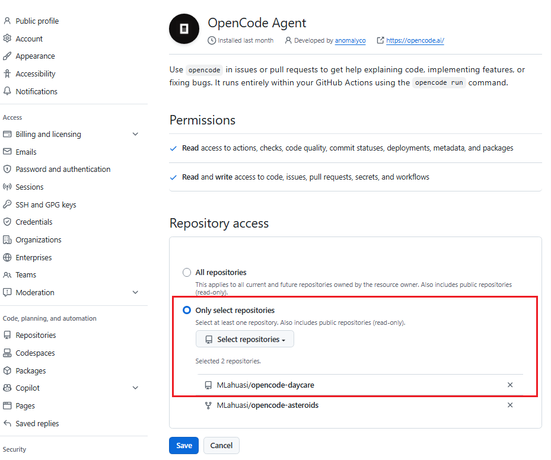
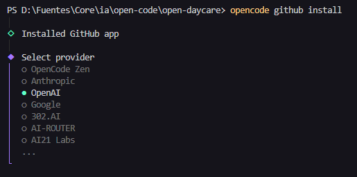
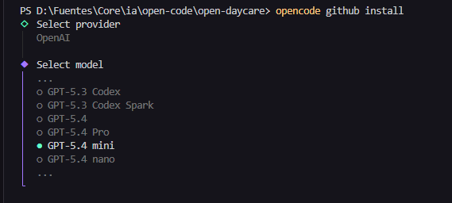
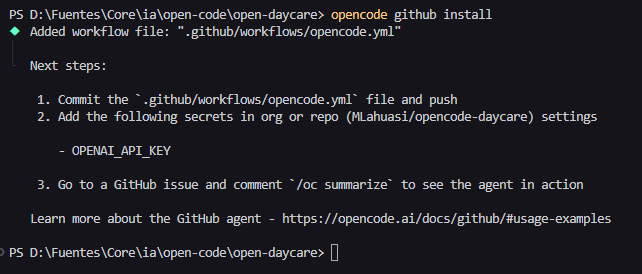
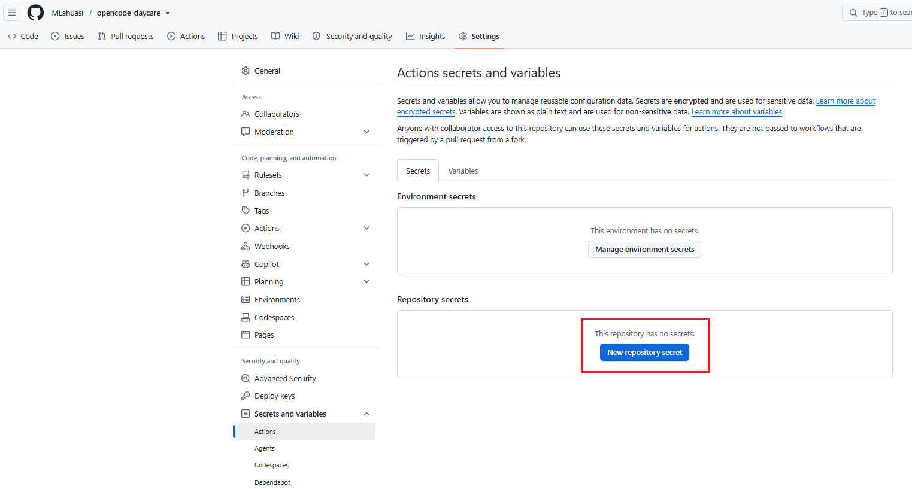
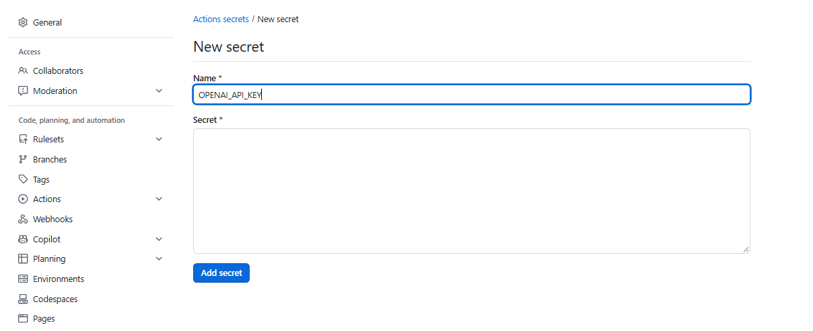
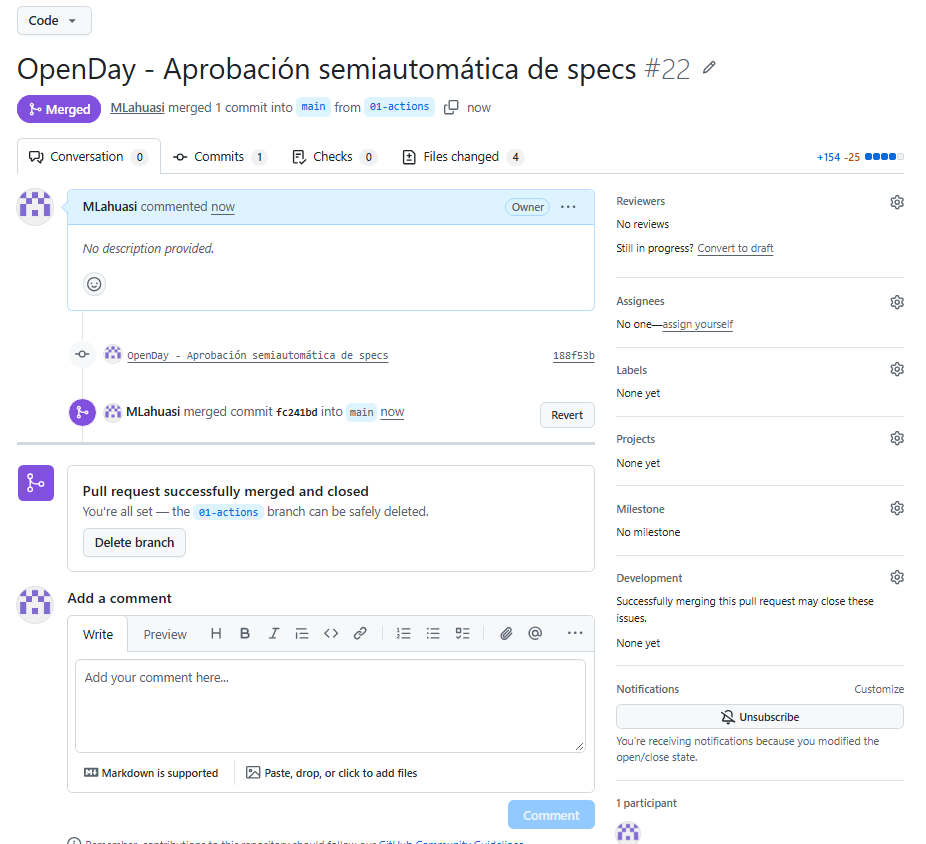
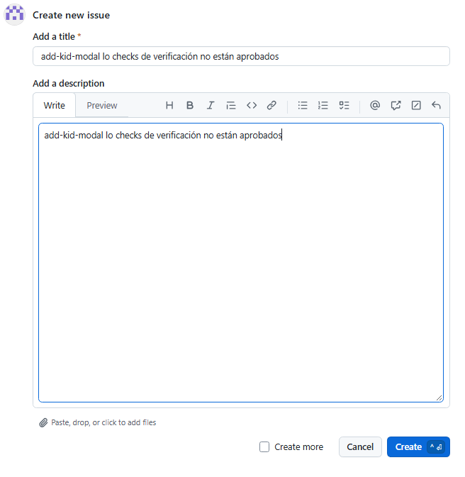
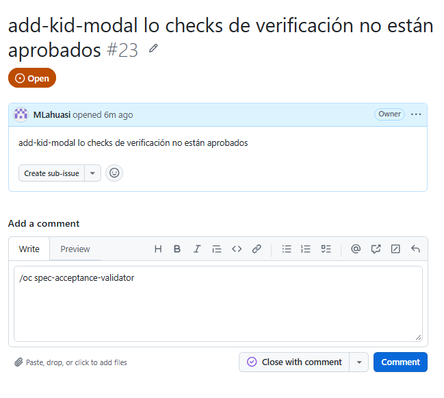

# [Aprobación semiautomática de Specs](https://opencode.ai/docs/github/#_top)

Funciona cuando se sube una Spec sin ejecutar previamente `@spec-acceptance-validator`.

1. Instalar OpenCode:

```bash
opencode github install
```

2. Se abre url de configuración:



3. Seleccionar en donde se quiere instalar (ambiente)

4. Aprobar ingreso a `GitHub`

5. Añadir el repositorio en el que se quiere automatizar la aprobación de `Specs` de forma semiautomática.



6. Seleccionar proveedor.



7. Seleccionar modelo.



8. Seguir los pasos indicados por la configuración.



9. Crear un `new repository secret`.



10. Pegar la API key del proveedor para crear `OPENAI_API_KEY`.



11. Crear una nueva rama, hacer commit y subir la rama para realizar un `pull request`

```bash
git checkout -b 01-actions
git add .
git commit -m "OpenDay - Aprobación semiautomática de specs"
git push -u origin 01-actions
```

12. Aprobar `spec` en `GitHub`



13. Actualizar cambios en `main` local, eliminar la rama temporal y eliminar la rama remota:

```bash
git switch main
git pull
git branch -d 01-actions
git push origin --delete 01-actions
```

El comando `git branch -d origin 01-actions` conserva el ejemplo original, pero contiene un error: `git branch -d` debe recibir el nombre de la rama local. La forma corregida es:

```bash
git branch -d 01-actions
```

14. Una vez configurado el `workflow de opencode`, se debe crear un `issue`



15. Se añade un comentario anteponiendo el comando `/oc` u `/opencode` y especificando el agente [`spec-acceptance-validator`](https://github.com/MLahuasi/opencode-daycare/blob/main/.opencode/agent/spec-acceptance-validator.md) que se quiere ejecutar:



---

[← Anterior](../08-opencode-github.md) | [Temario](../08-opencode-github.md) | [Siguiente →](../09-opencode-spec-driven-development.md)
