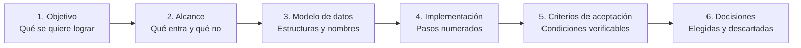
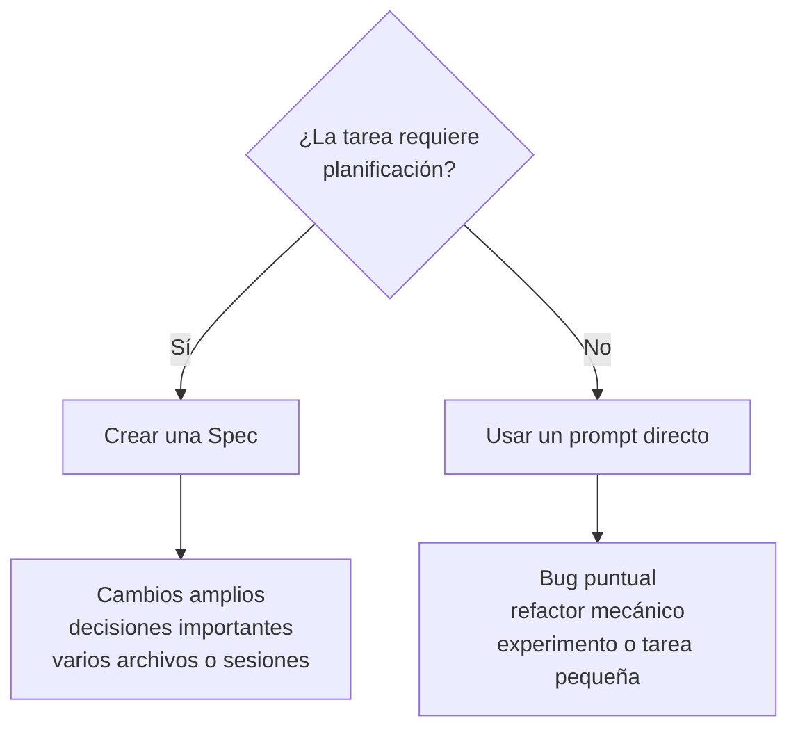

# La Spec como artefacto

Una `spec` es el artefacto central de Spec Driven Development.

Define **qué debe construirse, por qué debe construirse y qué decisiones deben respetarse durante su implementación**.

Una buena `spec` debe ser suficientemente clara para que otra sesión, otro agente o incluso otro desarrollador pueda continuar el trabajo sin depender del contexto original de la conversación.

## 1. Anatomía de una Spec

Una `spec` útil debería contener, como mínimo, los siguientes elementos:



### 1. Objetivo

Debe poder expresarse claramente en una frase.

Describe el resultado principal que se espera obtener.

### 2. Alcance

Define explícitamente:

- Qué forma parte de la funcionalidad.
- Qué comportamientos se implementarán.
- Qué elementos quedan fuera.

Definir qué **NO** se implementará evita que el agente amplíe innecesariamente la tarea.

### 3. Modelo de datos

Cuando sea necesario, especifica:

- Estructuras.
- Tipos.
- Propiedades.
- Nombres.
- Contratos.
- Relaciones relevantes.

### 4. Plan de implementación

La implementación debe dividirse en pasos pequeños, secuenciales y numerados.

Cada paso debería producir un cambio suficientemente pequeño como para poder revisarse mediante un `diff`.

### 5. Criterios de aceptación

Los criterios deben permitir comprobar de manera objetiva si la funcionalidad quedó correctamente implementada.

Evita criterios demasiado subjetivos.

Por ejemplo:

```text
El fantasma Blinky comienza a moverse inmediatamente al iniciar la partida.
```

es más verificable que:

```text
El comportamiento de Blinky debe sentirse correcto.
```

### 6. Decisiones tomadas y descartadas

Registrar las decisiones permite conocer:

- Qué alternativa fue seleccionada.
- Qué alternativas fueron descartadas.
- Por qué se tomó determinada decisión.

Esto resulta especialmente útil cuando la `spec` debe reutilizarse después de varias semanas o sesiones.

## 2. Cuándo utilizar una Spec

No todas las tareas necesitan una especificación formal.



### Conviene escribir una Spec cuando

- La funcionalidad tocará más de dos archivos.
- Existen decisiones costosas de revertir.
- Se modificarán esquemas, formatos o APIs públicas.
- Probablemente olvidarás detalles después de algunas semanas.
- El trabajo necesita más de una sesión.
- Existe un contrato que utilizarán otros artefactos.
- Otras `Skills`, agentes o `specs` dependerán de esas decisiones.
- La funcionalidad es suficientemente compleja como para necesitar planificación.

### Conviene utilizar un prompt directo cuando

- Es un bug puntual.
- Es un refactor mecánico.
- Solo se renombrarán o moverán archivos.
- Se trata de un experimento exploratorio.
- La decisión todavía debe descubrirse mediante experimentación.
- Toda la tarea cabe claramente dentro de un único prompt.
- Es una tarea única que probablemente no vuelva a repetirse.
- Planificar requiere más esfuerzo que implementar.

## 3. Regla práctica

Una forma sencilla de decidirlo:

> Si te tienta abrir `Plan Mode`, probablemente necesites una `spec`.

> Si la funcionalidad te parece demasiado pequeña como para justificar su planificación, probablemente no la necesite.

> Si la funcionalidad es importante para el proyecto, probablemente convenga documentarla mediante una `spec`.

---

[← Anterior](01-fundamentos-de-sdd.md) | [Temario](../09-opencode-spec-driven-development.md) | [Siguiente →](03-specs-skills-y-agentes.md)
