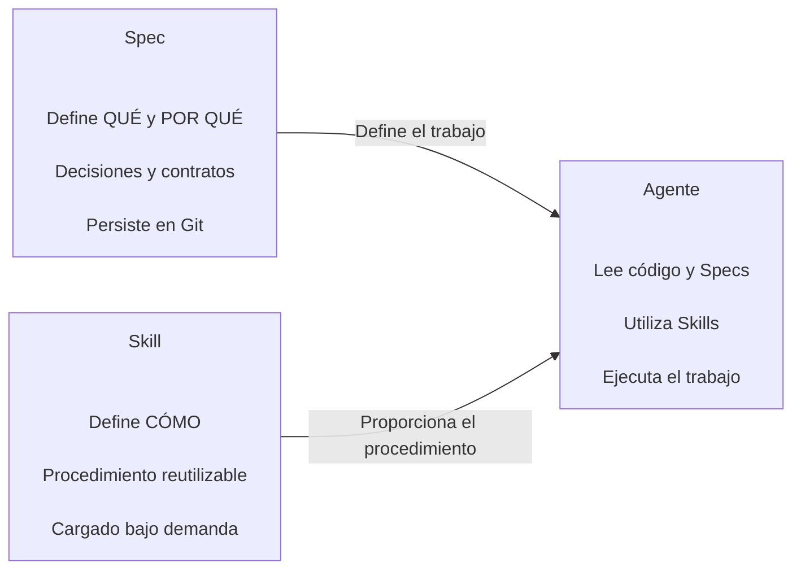

# Specs, Skills y agentes

`Specs`, `Skills` y agentes cumplen responsabilidades diferentes pero complementarias.



## 1. Spec

Una `spec`:

- Define el **qué**.
- Define el **por qué**.
- Registra decisiones de diseño.
- Define contratos.
- Es legible por humanos.
- Vive en Git.
- Persiste entre sesiones.

Ejemplo:

```text
specs/02-powerups.md
```

## 2. Skill

Una `Skill`:

- Define principalmente el **cómo repetible**.
- Describe un flujo de trabajo.
- Puede ser cargada cuando un agente la necesita.
- Puede servir como base para comandos o procesos recurrentes.
- Es legible por humanos.

Ejemplo conceptual:

```text
/new-powerup
```

## 3. Agente

Los agentes:

- Leen código.
- Consultan `specs`.
- Utilizan `Skills`.
- Toman referencias del proyecto.
- Comprenden las decisiones documentadas.
- Ejecutan las funcionalidades siguiendo esos contratos.

La documentación oficial de [Skills de OpenCode](https://opencode.ai/docs/skills/) describe las ubicaciones compatibles y el mecanismo de descubrimiento.

El ejemplo de creación y comprobación de una Skill reutilizable se conserva en [Crear una Skill con OpenCode](./ejemplos/skill-pokemon.md).

---

[← Anterior](02-la-spec-como-artefacto.md) | [Temario](../09-opencode-spec-driven-development.md) | [Siguiente →](04-preparar-opencode-para-sdd.md)
