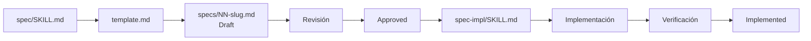

# Preparar OpenCode para SDD

## 1. Configuración del proyecto

Para este laboratorio se utilizan las Skills desarrolladas por [Klerith](https://github.com/Klerith/fernando-skills/tree/main), diseñadas para trabajar con un flujo basado en `specs`.

La responsabilidad de cada Skill es diferente:

- `/spec` crea y estructura la especificación.
- `/spec-impl` implementa una especificación que ya fue revisada y aprobada.

---

## 2. Instalar las Skills

Ejecutar:

```bash
# Instala las Skills disponibles desde el repositorio indicado.
npx skills add klerith/fernando-skills
```

Durante la instalación:

- No es necesario seleccionar un proveedor.
- Seleccionar las dos Skills relacionadas con `spec` y `spec-impl`.

Se generará una estructura similar a:

```text
.agents/
└── skills/
    ├── spec/
    │   ├── SKILL.md
    │   └── template.md
    │
    └── spec-impl/
        └── SKILL.md
```

Cada archivo cumple una responsabilidad.

### `.agents/skills/spec/SKILL.md`

Define el flujo utilizado para crear una especificación.

### `.agents/skills/spec/template.md`

Define la estructura de referencia utilizada para construir una `spec`.

### `.agents/skills/spec-impl/SKILL.md`

Define el flujo utilizado para implementar una `spec` que ya fue aprobada.

El flujo resultante puede representarse como:



---

## 3. Configurar OpenCode en el proyecto

Abrir `OpenCode` desde la consola dentro del proyecto.

Ejecutar el comando integrado:

```text
/init
```

`/init` analiza el repositorio y crea o actualiza `AGENTS.md` con instrucciones del proyecto. Revisa el archivo generado antes de registrarlo.

OpenCode descubre las Skills por separado, según su ubicación, y las carga bajo demanda; no se agregan automáticamente al contenido de `AGENTS.md`. Consulta [Rules de OpenCode](https://opencode.ai/docs/rules/) y [Skills de OpenCode](https://opencode.ai/docs/skills/).

Se creará:

[AGENTS.md](https://github.com/MLahuasi/opencode-pacman/blob/main/AGENTS.md)

Registrar posteriormente el cambio en Git:

```bash
# Agrega al staging todos los archivos modificados.
git add .

# Crea un commit con la configuración inicial de OpenCode.
git commit -m "OpenCode Skills - Create Agents.md"
```

---

[← Anterior](03-specs-skills-y-agentes.md) | [Temario](../09-opencode-spec-driven-development.md) | [Siguiente →](05-git-y-proteccion-de-main.md)
