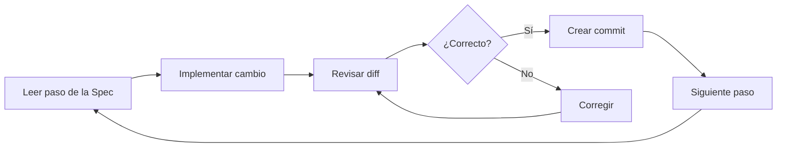

# Implementar, validar e integrar una Spec

## 1. Implementar una Spec

Con la especificación aprobada, cambiar a modo `Build` y ejecutar:

```text
/spec-impl specs/01-four-ghost-behaviors.md
```

La Skill `spec-impl` utilizará la especificación aprobada como contrato de implementación.

### 1.1 Creación de la rama

Si está configurado:

```yml
AutoCreateBranch: true
```

se crea automáticamente una nueva rama para agrupar todos los cambios correspondientes a la `spec`.

Por ejemplo:

```text
spec-01-four-ghost-behaviors
```

Esto permite aislar completamente la funcionalidad de `main`.

### 1.2 Cambiar el IDE a la rama

Si OpenCode crea la rama desde otro contexto o `worktree`, el IDE debe trabajar sobre la rama correcta antes de revisar o modificar los archivos.

```bash
# Cambia el repositorio actual a la rama creada para implementar la spec.
git switch spec-01-four-ghost-behaviors

# Muestra los worktrees existentes y las ramas asociadas.
git worktree list
```

### 1.3 Implementación paso a paso

OpenCode ejecutará secuencialmente los puntos definidos dentro de:

[01-four-ghost-behaviors.md](https://github.com/MLahuasi/opencode-pacman/blob/main/specs/01-four-ghost-behaviors.md)

El flujo recomendado es:



Es importante revisar los cambios a medida que el agente completa cada paso.

Esto evita acumular errores y permite mantener cada modificación claramente relacionada con el punto correspondiente de la `spec`.

#### Crear un commit por cada paso completado

Cuando un cambio correspondiente a un paso de la `spec` haya sido:

1. Implementado.
2. Revisado mediante su `diff`.
3. Validado como correcto.

se recomienda crear inmediatamente un `commit`.

Si para implementar la `spec` se creó una rama específica, estos commits deben realizarse dentro de esa rama.

Por ejemplo:

```bash
# Agrega al staging los cambios correspondientes al paso implementado.
git add .

# Registra el cambio correspondiente al paso completado.
git commit -m "Implement ghost release timing"
```

Después se continúa con el siguiente paso de la `spec`.

El flujo sería:

```text
Paso 1
  ↓
Implementar
  ↓
Revisar diff
  ↓
Validar
  ↓
Commit
  ↓
Paso 2
  ↓
Implementar
  ↓
Revisar diff
  ↓
Validar
  ↓
Commit
  ↓
...
```

Esto permite que cada `commit` represente una unidad de cambio concreta y facilita:

- Revisar la evolución de la implementación.
- Relacionar los commits con los pasos de la `spec`.
- Detectar dónde se introdujo un problema.
- Revertir un cambio específico sin afectar toda la funcionalidad.
- Revisar posteriormente el Pull Request mediante cambios pequeños y comprensibles.

> **IMPORTANTE:** el `commit` debe realizarse después de revisar y validar el cambio, no simplemente después de que el agente termine de modificar los archivos.

#### Verificar el estado antes de finalizar

Una vez completados todos los pasos de la `spec`, comprobar que no existan cambios pendientes:

```bash
# Muestra el estado actual del repositorio.
git status
```

Idealmente, todos los cambios deberían haber sido registrados durante la implementación paso a paso.

Si existen cambios pendientes, se debe revisar primero por qué no fueron incluidos en alguno de los commits anteriores.

Si corresponden legítimamente a la implementación de la `spec`, revisarlos y registrarlos antes de continuar con la validación final:

```bash
# Agrega al staging los cambios pendientes que ya fueron revisados.
git add .

# Registra los cambios pendientes antes de finalizar la implementación.
git commit -m "Complete pending spec changes"
```

Este último commit debería ser excepcional. El flujo recomendado es registrar los cambios conforme se completa cada paso de la `spec`.

Antes de pasar a la validación final, la rama debería quedar limpia:

```text
git status
↓
Working tree clean
↓
Continuar con la validación de la Spec
```

Si durante la ejecución aparece una modificación que cambia decisiones importantes de diseño, conviene regresar a la fase de planificación y modificar la `spec` antes de continuar.

---

## 2. Validar y cerrar la Spec

Cuando todos los pasos han terminado, solicitar la validación final de la implementación.

La revisión debe comprobar que:

- Los pasos definidos fueron implementados.
- Los criterios de aceptación se cumplen.
- No existen cambios fuera del alcance.
- El código funciona según la especificación.
- No existen modificaciones inesperadas.

Si la validación es correcta, la `spec` puede cerrarse como implementada.

Conceptualmente:

```text
Draft
  ↓
Approved
  ↓
Implementation
  ↓
Validation
  ↓
Implemented
```

---

## 3. Integrar mediante Pull Request

Publicar la rama:

```bash
# Publica la rama de la spec en GitHub y configura su upstream.
git push -u origin spec-01-four-ghost-behaviors
```

En GitHub:

1. Crear el Pull Request.
2. Revisar los cambios.
3. Comprobar los criterios definidos en la `spec`.
4. Aprobar el Pull Request.
5. Ejecutar el merge.
6. Eliminar la rama remota.

Después del merge, actualizar el repositorio local:

```bash
# Regresa a la rama principal.
git checkout main

# Descarga e integra la versión más reciente de main.
git pull

# Elimina la rama local que ya fue integrada.
git branch -d spec-01-four-ghost-behaviors
```

---

[← Anterior](06-crear-generar-y-aprobar-una-spec.md) | [Temario](../09-opencode-spec-driven-development.md) | [Siguiente →](08-flujo-principios-y-modelo-mental.md)
