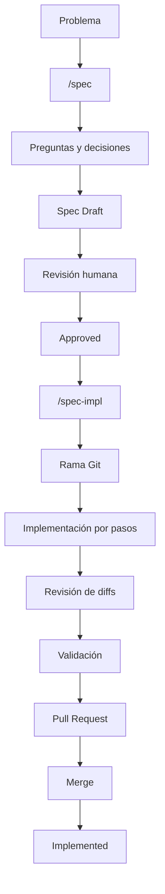
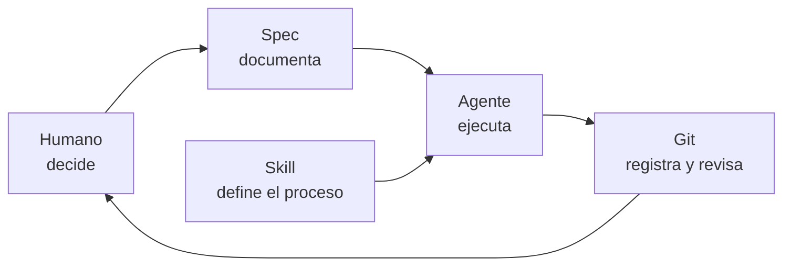

# Flujo, principios y modelo mental de SDD

## 1. Flujo completo de SDD utilizado en el laboratorio

El proceso completo utilizado en `opencode-pacman` puede resumirse así:



La idea principal es que el agente no pase directamente desde una solicitud a una gran implementación.

En cambio:

```text
Problema
   ↓
Planificación
   ↓
Decisiones
   ↓
Spec
   ↓
Aprobación humana
   ↓
Implementación incremental
   ↓
Revisión
   ↓
Validación
   ↓
Integración
```

## 2. Principios principales

A partir del laboratorio se pueden resumir varios principios de trabajo.

### La conversación no debe ser la única fuente de contexto

Las decisiones importantes deben persistir dentro del repositorio.

Una `spec` permite conservarlas aunque:

- Cambie la sesión.
- Se compacte el contexto.
- Otro agente continúe el trabajo.
- Otro desarrollador implemente la funcionalidad.

### La Spec funciona como contrato

La implementación debe respetar lo definido en la especificación aprobada.

Si una decisión importante cambia, primero debe actualizarse la especificación.

### Los cambios deben ser pequeños

Implementar paso a paso permite:

- Revisar mejor.
- Comprender cada modificación.
- Detectar errores antes.
- Revertir cambios con mayor facilidad.

### Las Skills permiten reutilizar procedimientos

No es necesario volver a explicar en cada conversación cómo crear o implementar una `spec`.

Ese procedimiento puede persistir como una `Skill`.

### Git proporciona trazabilidad

Las ramas, commits, `diffs` y Pull Requests permiten relacionar:

```text
Spec
  ↓
Implementación
  ↓
Cambios
  ↓
Revisión
  ↓
Integración
```

### El humano mantiene el control de las decisiones

El agente puede:

- Analizar.
- Proponer.
- Preguntar.
- Implementar.
- Validar.

Pero las decisiones importantes de alcance y diseño deben aprobarse antes de modificar el sistema.

## 3. Modelo mental

Una forma sencilla de entender la relación entre los componentes es:



En este modelo:

- **El humano decide.**
- **La `spec` conserva las decisiones.**
- **La `Skill` define cómo ejecutar un procedimiento repetible.**
- **El agente implementa siguiendo esas instrucciones.**
- **Git registra los cambios y permite revisarlos antes de integrarlos.**

Este flujo convierte una conversación con un agente en un proceso de desarrollo más estructurado, reproducible y verificable.

---

[← Anterior](07-implementar-validar-e-integrar.md) | [Temario](../09-opencode-spec-driven-development.md)
